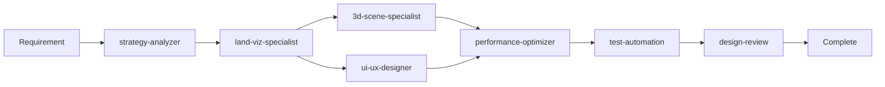
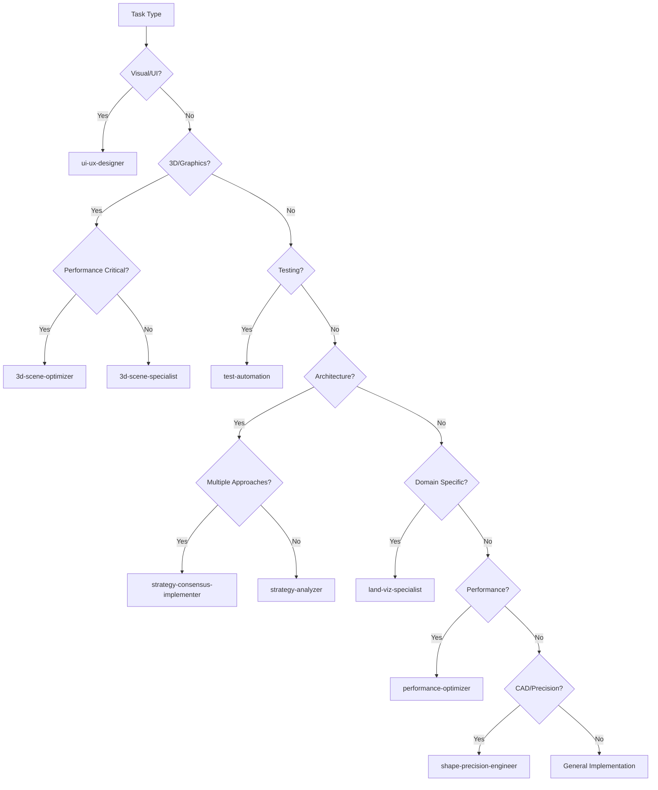

# Cross-Agent Workflows for Land Visualizer

## Overview

This document outlines how multiple specialized agents collaborate to accomplish complex tasks in the Land Visualizer project. These workflows demonstrate agent orchestration patterns for efficient feature development, optimization, and maintenance.

## Workflow Patterns

### Sequential Pattern
Agents work in sequence, each building on the previous agent's output.
```
Agent A → Agent B → Agent C → Final Result
```

### Parallel Pattern
Multiple agents work simultaneously on different aspects.
```
      ├→ Agent A ─┐
Start ├→ Agent B ─┼→ Merge → Result
      └→ Agent C ─┘
```

### Hub Pattern
One coordinator agent manages multiple specialist agents.
```
         ┌→ Agent B
Agent A ─┼→ Agent C
         └→ Agent D
```

### Consensus Pattern
Multiple agents provide solutions, then consensus is reached.
```
Strategy 1 → Analyzer A ─┐
Strategy 2 → Analyzer B ─┼→ Consensus → Implementation
Strategy 3 → Analyzer C ─┘
```

---

## Major Workflow Scenarios

## 1. 🚀 New Feature Implementation Workflow

### Scenario: Adding Terrain Elevation Visualization

**Agents Involved:**
- `strategy-analyzer` - Planning the approach
- `land-viz-specialist` - Domain expertise
- `3d-scene-specialist` - 3D implementation
- `ui-ux-designer` - Interface design
- `performance-optimizer` - Optimization
- `test-automation` - Testing
- `design-review` - Quality assurance

### Workflow Sequence:



### Execution Commands:

```bash
# Phase 1: Strategic Planning
@strategy-analyzer "Plan implementation of terrain elevation visualization with height maps, contour lines, and 3D mesh generation"

# Phase 2: Domain Analysis (Parallel)
@land-viz-specialist "Design elevation data structure and processing pipeline for terrain visualization"
@ui-ux-designer "Create elevation controls UI with height adjustment, color mapping, and contour settings"

# Phase 3: Implementation (Sequential)
@3d-scene-specialist "Implement terrain mesh generation with height map textures and LOD system"

# Phase 4: Optimization
@performance-optimizer "Optimize terrain rendering for large datasets with GPU instancing and culling"

# Phase 5: Testing (Parallel)
@test-automation "Create tests for elevation calculations, mesh generation, and UI controls"
@design-review "Review terrain visualization UI across devices and check performance metrics"
```

### Agent Handoffs:

```javascript
// strategy-analyzer output → land-viz-specialist input
const strategyOutput = {
  architecture: "height-map-based",
  dataFlow: ["GeoTIFF → Parser → Mesh → Renderer"],
  components: ["ElevationProcessor", "TerrainMesh", "ContourGenerator"]
};

// land-viz-specialist output → 3d-scene-specialist input
const domainOutput = {
  dataStructure: {
    elevationGrid: Float32Array,
    resolution: { x: 1024, y: 1024 },
    bounds: { min: 0, max: 500 }
  },
  processingSteps: ["normalize", "smooth", "generateNormals"]
};

// 3d-scene-specialist output → performance-optimizer input
const sceneOutput = {
  meshComplexity: 1048576, // vertices
  drawCalls: 24,
  textureMemory: "256MB",
  updateFrequency: "static"
};
```

---

## 2. 🐛 Bug Fix Workflow

### Scenario: Shape rotation causing memory leak

**Agents Involved:**
- `strategy-analyzer` - Root cause analysis
- `performance-optimizer` - Memory profiling
- `3d-scene-specialist` - Fix implementation
- `test-automation` - Regression testing

### Workflow Sequence:

```bash
# Phase 1: Analysis (Parallel)
@strategy-analyzer "Analyze shape rotation memory leak in Three.js scene"
@performance-optimizer "Profile memory usage during shape rotation operations"

# Phase 2: Solution Design
@3d-scene-specialist "Fix geometry disposal in rotation system"

# Phase 3: Verification
@test-automation "Create memory leak regression tests for shape rotation"
```

### Collaborative Analysis:

```javascript
// performance-optimizer findings
const memoryProfile = {
  leak: {
    location: "RotationControls.js:234",
    type: "THREE.BufferGeometry",
    growthRate: "10MB per rotation",
    cause: "geometry not disposed"
  }
};

// strategy-analyzer solution
const solution = {
  pattern: "Resource Management",
  approach: "Implement disposal queue",
  preventionStrategy: "Add geometry pooling"
};

// 3d-scene-specialist implementation
const fix = {
  immediate: "Add geometry.dispose() in cleanup",
  longTerm: "Implement object pooling system",
  monitoring: "Add memory tracking metrics"
};
```

---

## 3. 🎨 UI/UX Redesign Workflow

### Scenario: Redesigning measurement tools interface

**Agents Involved:**
- `ui-ux-designer` - Design creation
- `land-viz-specialist` - Domain validation
- `3d-scene-specialist` - 3D integration
- `test-automation` - Usability testing
- `design-review` - Design QA
- `performance-optimizer` - UI performance

### Parallel Execution Pattern:

```bash
# Phase 1: Design & Validation (Parallel)
@ui-ux-designer "Redesign measurement tools with modern UI, tooltips, and unit conversion"
@land-viz-specialist "Validate measurement UI requirements for survey-grade accuracy"

# Phase 2: Implementation (Parallel)
@3d-scene-specialist "Update 3D measurement overlay rendering with new design"
@test-automation "Create UI interaction tests for measurement tools"

# Phase 3: Review & Optimization (Sequential)
@design-review "Review measurement UI accessibility and responsive design"
@performance-optimizer "Optimize measurement overlay rendering performance"
```

---

## 4. 🏗️ Architecture Refactoring Workflow

### Scenario: Migrating to microservices architecture

**Agents Involved:**
- `strategy-consensus-implementer` - Orchestrate multiple strategies
- `strategy-analyzer` (×8) - Different architectural approaches
- `performance-optimizer` - Performance impact analysis
- `test-automation` - Migration testing

### Consensus Pattern Implementation:

```bash
# Phase 1: Multi-Strategy Analysis
@strategy-consensus-implementer "Analyze microservices migration for Land Visualizer with 8 different architectural strategies"

# The consensus implementer will spawn:
# - Strategy 1: Domain-driven design approach
# - Strategy 2: Event-driven architecture
# - Strategy 3: Service mesh pattern
# - Strategy 4: Serverless functions
# - Strategy 5: Modular monolith first
# - Strategy 6: Strangler fig pattern
# - Strategy 7: Database-per-service
# - Strategy 8: API gateway pattern

# Phase 2: Performance Analysis
@performance-optimizer "Analyze performance implications of consensus microservices architecture"

# Phase 3: Testing Strategy
@test-automation "Design testing strategy for microservices migration"
```

---

## 5. 🚄 Performance Optimization Workflow

### Scenario: Optimizing large dataset rendering (10,000+ shapes)

**Agents Involved:**
- `performance-optimizer` - Profiling and strategy
- `3d-scene-specialist` - Rendering optimization
- `3d-scene-optimizer` - Three.js specific optimization
- `land-viz-specialist` - Data structure optimization
- `test-automation` - Performance testing

### Optimization Pipeline:

```bash
# Phase 1: Profiling
@performance-optimizer "Profile rendering performance with 10,000 shapes dataset"

# Phase 2: Parallel Optimization
@3d-scene-specialist "Implement LOD system and instanced rendering for shapes"
@3d-scene-optimizer "Optimize draw calls with geometry batching and texture atlasing"
@land-viz-specialist "Implement spatial indexing for viewport culling"

# Phase 3: Verification
@test-automation "Create performance benchmarks for large datasets"
```

### Performance Metrics Flow:

```javascript
// performance-optimizer baseline
const baseline = {
  fps: 12,
  drawCalls: 10000,
  triangles: 5000000,
  memoryUsage: "2GB"
};

// 3d-scene-specialist optimizations
const lodOptimization = {
  technique: "Level of Detail",
  improvement: { fps: "+300%", memory: "-40%" }
};

// 3d-scene-optimizer optimizations
const batchingOptimization = {
  technique: "Geometry Batching",
  improvement: { drawCalls: "-95%", fps: "+200%" }
};

// Final results
const optimized = {
  fps: 58,
  drawCalls: 50,
  triangles: 1000000,
  memoryUsage: "800MB"
};
```

---

## 6. 📱 Mobile Experience Workflow

### Scenario: Creating mobile-optimized drawing experience

**Agents Involved:**
- `ui-ux-designer` - Mobile UI design
- `3d-scene-specialist` - Touch controls
- `performance-optimizer` - Mobile optimization
- `design-review` - Mobile testing
- `test-automation` - Cross-device testing

### Mobile Development Flow:

```bash
# Phase 1: Design
@ui-ux-designer "Design mobile-first drawing interface with touch gestures"

# Phase 2: Implementation (Parallel)
@3d-scene-specialist "Implement touch controls for camera and drawing"
@performance-optimizer "Optimize for mobile GPU and memory constraints"

# Phase 3: Testing (Parallel)
@design-review "Test on iOS and Android devices with different screen sizes"
@test-automation "Create touch gesture test suite"
```

---

## 7. 🔧 CAD Integration Workflow

### Scenario: Integrating Chili3D CAD engine

**Agents Involved:**
- `chili3d-integration` - CAD integration lead
- `shape-precision-engineer` - Precision geometry
- `land-viz-specialist` - Domain integration
- `3d-scene-specialist` - Visualization bridge
- `test-automation` - Integration testing

### Integration Sequence:

```bash
# Phase 1: Core Integration
@chili3d-integration "Setup Chili3D WebAssembly module with OpenCascade kernel"

# Phase 2: Feature Implementation (Parallel)
@shape-precision-engineer "Implement boolean operations with exact arithmetic"
@land-viz-specialist "Map CAD entities to land visualization objects"

# Phase 3: Visualization Bridge
@3d-scene-specialist "Convert CAD geometry to Three.js meshes"

# Phase 4: Testing
@test-automation "Create CAD integration test suite with STEP file imports"
```

---

## 8. 📊 Documentation Generation Workflow

### Scenario: Generating comprehensive project documentation

**Agents Involved:**
- `land-documentation-generator` - Documentation lead
- `strategy-analyzer` - Architecture documentation
- `test-automation` - Test documentation
- `ui-ux-designer` - UI component documentation

### Documentation Pipeline:

```bash
# Phase 1: Parallel Documentation Generation
@land-documentation-generator "Generate API documentation for all services"
@strategy-analyzer "Document system architecture and design patterns"
@ui-ux-designer "Create UI component library documentation"
@test-automation "Generate test coverage reports and testing guide"

# Phase 2: Integration
@land-documentation-generator "Compile comprehensive project documentation"
```

---

## Agent Selection Decision Tree



---

## Parallel vs Sequential Execution Guidelines

### Use Parallel Execution When:
- Tasks are independent
- Different aspects of the same feature
- Multiple analyses needed
- Time is critical
- Testing different components

### Example Parallel Command:
```bash
# Single message with multiple agents
@ui-ux-designer "Design elevation controls"
@3d-scene-specialist "Implement terrain mesh"
@test-automation "Create elevation tests"
```

### Use Sequential Execution When:
- Output of one agent feeds into another
- Dependencies exist between tasks
- Order matters for correctness
- Building on previous results

### Example Sequential Command:
```bash
# Step 1
@strategy-analyzer "Analyze terrain feature requirements"

# Step 2 (after reviewing output)
@land-viz-specialist "Design elevation data structure based on strategy"

# Step 3 (after reviewing output)
@3d-scene-specialist "Implement terrain based on data structure"
```

---

## Complex Workflow Example: Complete Feature Cycle

### Scenario: Area Comparison Tool with 3D Visualization

```bash
# Day 1: Planning & Design
## Morning (Parallel)
@strategy-analyzer "Plan area comparison feature with reference objects"
@ui-ux-designer "Design comparison UI with object selection and stats display"

## Afternoon (Sequential)
@land-viz-specialist "Define comparison data models and calculations"

# Day 2: Implementation
## Morning (Parallel)
@3d-scene-specialist "Implement 3D reference object rendering"
@shape-precision-engineer "Create precise area calculation algorithms"

## Afternoon (Sequential)
@performance-optimizer "Optimize reference object loading and caching"

# Day 3: Testing & Polish
## Morning (Parallel)
@test-automation "Create comparison feature test suite"
@design-review "Review comparison UI across devices"

## Afternoon (Sequential)
@3d-scene-optimizer "Final rendering optimizations"
@land-documentation-generator "Document comparison feature API"
```

---

## Workflow Optimization Tips

### 1. **Maximize Parallelization**
```javascript
// Identify independent tasks
const tasks = {
  independent: [
    "UI design",
    "API design",
    "Database schema",
    "Test planning"
  ],
  dependent: [
    "Implementation → Testing",
    "Design → Implementation"
  ]
};
```

### 2. **Clear Handoff Points**
```javascript
// Define explicit interfaces between agents
const handoff = {
  from: "strategy-analyzer",
  to: "land-viz-specialist",
  data: {
    architecture: "defined",
    components: ["listed"],
    interfaces: ["specified"]
  }
};
```

### 3. **Feedback Loops**
```javascript
// Iterate based on agent outputs
const iteration = {
  cycle1: ["design", "review", "refine"],
  cycle2: ["implement", "test", "optimize"],
  cycle3: ["deploy", "monitor", "improve"]
};
```

### 4. **Error Recovery**
```javascript
// Plan for agent failures
const recovery = {
  ifAgentFails: "strategy-analyzer",
  fallbackTo: "manual-analysis",
  alternativeAgent: "strategy-consensus-implementer"
};
```

---

## Monitoring Agent Collaboration

### Success Metrics
```javascript
const workflowMetrics = {
  efficiency: {
    parallelization: "% of tasks run in parallel",
    handoffTime: "Average time between agent handoffs",
    reworkRate: "% of tasks requiring revision"
  },
  quality: {
    defectRate: "Bugs per feature",
    testCoverage: "% of code tested",
    performanceGain: "Optimization improvements"
  },
  velocity: {
    timeToComplete: "Feature completion time",
    agentUtilization: "% of agent capacity used",
    bottlenecks: "Identified slow points"
  }
};
```

### Workflow Optimization Checklist
- [ ] Identify independent tasks for parallelization
- [ ] Define clear input/output contracts between agents
- [ ] Plan error recovery strategies
- [ ] Set up monitoring for bottlenecks
- [ ] Document handoff points
- [ ] Create feedback mechanisms
- [ ] Establish success criteria

---

## Common Anti-Patterns to Avoid

### 1. **Sequential Everything**
❌ Running all agents one after another
✅ Identify and parallelize independent tasks

### 2. **Missing Handoffs**
❌ Not passing context between agents
✅ Explicitly define data passed between agents

### 3. **Over-Orchestration**
❌ Using complex patterns for simple tasks
✅ Match workflow complexity to task complexity

### 4. **Ignoring Dependencies**
❌ Running dependent tasks in parallel
✅ Respect task dependencies and prerequisites

### 5. **No Feedback Loops**
❌ Linear workflow with no iteration
✅ Build in review and refinement cycles

---

## Quick Reference: Agent Specializations

| Agent | Primary Role | Best For |
|-------|------------|----------|
| `strategy-analyzer` | Strategic planning | Architecture, approach design |
| `strategy-consensus-implementer` | Multi-strategy consensus | Complex decisions needing multiple viewpoints |
| `ui-ux-designer` | Interface design | UI/UX, components, accessibility |
| `land-viz-specialist` | Domain expertise | Land-specific features, GIS |
| `3d-scene-specialist` | 3D implementation | Three.js, rendering, camera |
| `3d-scene-optimizer` | Graphics optimization | Performance, GPU, WebGL |
| `performance-optimizer` | System optimization | Memory, bundle, runtime |
| `shape-precision-engineer` | Geometric precision | Exact calculations, CAD |
| `test-automation` | Testing | Unit, integration, E2E tests |
| `testing-orchestrator` | Test coordination | Complex test scenarios |
| `design-review` | Quality assurance | UI review, accessibility audit |
| `chili3d-integration` | CAD integration | Chili3D, OpenCascade |
| `geospatial-processor` | GIS processing | Coordinates, projections |
| `land-documentation-generator` | Documentation | API docs, reports |
| `cad-feature-builder` | CAD features | AutoCAD-like functionality |

---

## Workflow Templates

### Template 1: Feature Development
```bash
@strategy-analyzer "Plan [FEATURE]"
@ui-ux-designer "Design [FEATURE] interface"
@land-viz-specialist "Define [FEATURE] domain logic"
@3d-scene-specialist "Implement [FEATURE] visualization"
@test-automation "Test [FEATURE]"
@design-review "Review [FEATURE]"
```

### Template 2: Performance Issue
```bash
@performance-optimizer "Profile [ISSUE]"
@3d-scene-optimizer "Optimize rendering for [ISSUE]"
@test-automation "Create performance benchmarks"
```

### Template 3: Bug Fix
```bash
@strategy-analyzer "Analyze root cause of [BUG]"
@[SPECIALIST] "Fix [BUG]"
@test-automation "Create regression test for [BUG]"
```

### Template 4: Refactoring
```bash
@strategy-consensus-implementer "Evaluate refactoring approaches for [COMPONENT]"
@performance-optimizer "Measure refactoring impact"
@test-automation "Ensure backward compatibility"
```

---

## Conclusion

Effective agent collaboration is key to efficient Land Visualizer development. By understanding:
- When to use parallel vs sequential execution
- How to structure agent handoffs
- Which agents to involve for specific tasks
- How to optimize workflows

Teams can leverage the full power of specialized agents to deliver high-quality features faster and with fewer defects.

Remember: The goal is not to use all agents for every task, but to select the right combination for optimal results.

---

*Last Updated: October 2025*
*Version: 1.0*
*Land Visualizer Cross-Agent Workflows*