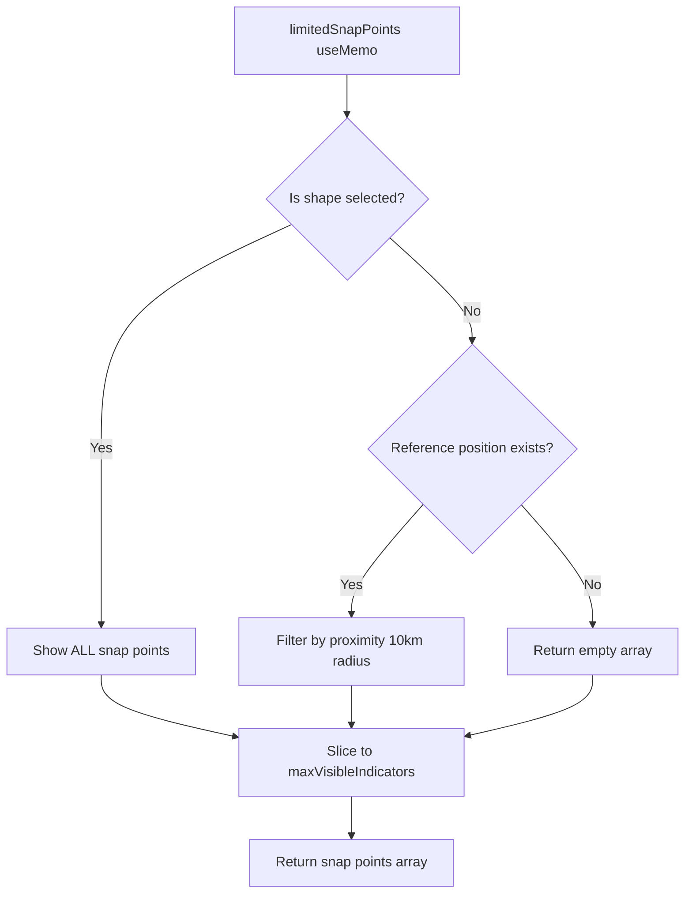

# Selected Shape Snap Indicators Visibility Fix

**Date**: January 2025
**Status**: ✅ Complete
**Severity**: ⭐⭐⭐ Critical (User Experience)

## Problem Statement

Snap indicators (blue endpoint circles, orange midpoint squares, green center crosshairs) were inconsistently appearing on selected shapes. Users experienced:

1. **Random Missing Indicators**: Different corners or edges would randomly not show indicators
2. **Zoom-Dependent Visibility**: Indicators only appeared after zooming in and hovering
3. **Deselect/Reselect Required**: Users had to deselect, zoom in, reselect, and hover to see all indicators
4. **Inconsistent Behavior**: Same shape would show different indicators on different selections

## Root Causes

### 1. Indicators Hidden When Shape Selected Without Cursor Movement
**Location**: `app/src/components/Scene/SnapIndicator.tsx:85-88` (before fix)

**Problem**:
```typescript
// Return empty array if no reference position
if (!referencePosition) {
  return [];
}
```

When a shape was selected without moving the cursor, `cursorPosition` was null, causing `referencePosition` to be null, which returned an empty array - no indicators shown.

**Why It Happened**: The code required a cursor position to calculate proximity filtering, even when showing all snap points for selected shapes.

---

### 2. 25 Indicator Limit Applied to Selected Shapes
**Location**: `app/src/components/Scene/SnapIndicator.tsx:56` (before fix)

**Problem**:
```typescript
const maxVisibleIndicators = 25; // Limit to 25 indicators for performance
```

When showing snap points for selected shapes, the code showed snap points from **all shapes in the scene**, then limited to 25 total. For scenes with multiple shapes, this randomly cut off indicators from the selected shape.

**Why It Happened**: Performance optimization was applied globally without considering the selected shape use case.

---

### 3. Camera-Distance Culling Hid Far Indicators
**Location**: `app/src/components/Scene/SnapIndicator.tsx:352-356` (before fix)

**Problem**:
```typescript
// Cull distant points
if (distance > maxDistance) {  // maxDistance = 100 units
  child.visible = false;
  return;
}
```

When zoomed out, indicators beyond 100 units from the camera were hidden. This caused random corners/edges to disappear based on camera position and zoom level.

**Why Zooming In "Fixed" It**: Zooming in brought the camera closer to all points, making them fall within the 100-unit threshold.

---

### 4. shouldShowIndicators Didn't Include Selection
**Location**: `app/src/components/Scene/SnapIndicator.tsx:379` (before fix)

**Problem**:
```typescript
const shouldShowIndicators = (isDrawing || isDragging || isResizeMode ||
  isActivelyResizing || isHoveringWithDrawingTool) && snapping.config.enabled;
```

Indicators only showed during active operations (drawing, dragging, resizing), not when a shape was simply selected.

**Why Hovering "Fixed" It**: Moving the cursor triggered `isHoveringWithDrawingTool` if a drawing tool was active, which showed indicators.

## Solutions

### Fix 1: Check Selection Before Reference Position
**File**: `app/src/components/Scene/SnapIndicator.tsx`

```typescript
// BEFORE (Lines 85-103):
// Return empty array if no reference position
if (!referencePosition) {
  return [];
}

const isShowingSelectedShape = selectedShapeIds && selectedShapeIds.length > 0;

const proximityFilteredPoints = isShowingSelectedShape
  ? (snapping?.availableSnapPoints || [])
  : (snapping?.availableSnapPoints || []).filter(point =>
      validateSnapPointProximity(point, referencePosition, 10000)
    );

// AFTER (Lines 89-104):
// CRITICAL FIX: For selected shapes, show ALL snap points without distance filtering
// Note: isShowingSelectedShape is already calculated above

// If showing selected shape, don't filter by distance - show all snap points
// No reference position needed when showing all points for selected shapes
const proximityFilteredPoints = isShowingSelectedShape
  ? (snapping?.availableSnapPoints || [])
  : !referencePosition
    ? [] // No reference position and not showing selected shape = no indicators
    : (snapping?.availableSnapPoints || []).filter(point =>
        validateSnapPointProximity(point, referencePosition, 10000)
      );
```

**Impact**: Selected shapes show all indicators immediately, without requiring cursor movement.

---

### Fix 2: Remove Indicator Limit for Selected Shapes
**File**: `app/src/components/Scene/SnapIndicator.tsx`

```typescript
// BEFORE (Line 56):
const maxVisibleIndicators = 25; // Limit to 25 indicators for performance

// AFTER (Lines 55-59):
// Performance optimization: limit visible indicators with render-time proximity filtering
// CRITICAL: For selected shapes, show ALL indicators - no limit
// For other cases (drawing, dragging), limit to 25 for performance
const isShowingSelectedShape = selectedShapeIds && selectedShapeIds.length > 0;
const maxVisibleIndicators = isShowingSelectedShape ? Infinity : 25;
```

**Impact**: All indicators on selected shapes are shown, regardless of scene complexity.

---

### Fix 3: Disable Camera-Distance Culling for Selected Shapes
**File**: `app/src/components/Scene/SnapIndicator.tsx`

```typescript
// BEFORE (Lines 348-356):
const distance = cameraPosition.distanceTo(
  new THREE.Vector3(snapPoint.position.x, 0, snapPoint.position.y)
);

// Cull distant points
if (distance > maxDistance) {
  child.visible = false;
  return;
}

// AFTER (Lines 352-365):
// CRITICAL FIX: For selected shapes, disable camera-distance culling
// This ensures all indicators stay visible regardless of zoom level
// For other cases (drawing, dragging), use normal distance culling for performance
if (!isShowingSelectedShape) {
  const distance = cameraPosition.distanceTo(
    new THREE.Vector3(snapPoint.position.x, 0, snapPoint.position.y)
  );

  // Cull distant points when not showing selected shape
  if (distance > maxDistance) {
    child.visible = false;
    return;
  }
}

child.visible = true;
```

**Impact**: All indicators remain visible on selected shapes at any zoom level.

---

### Fix 4: Show Indicators When Shape Selected
**File**: `app/src/components/Scene/SnapIndicator.tsx`

```typescript
// BEFORE (Lines 372-379):
// Show indicators when:
// 1. Actively drawing or dragging shapes
// 2. Hovering with a drawing tool active
// 3. In resize mode
// 4. Actively resizing
const shouldShowIndicators = (isDrawing || isDragging || isResizeMode ||
  isActivelyResizing || isHoveringWithDrawingTool) && snapping.config.enabled;

// AFTER (Lines 372-381):
// Show indicators when:
// 1. Actively drawing or dragging shapes
// 2. Hovering with a drawing tool active
// 3. In resize mode
// 4. Actively resizing
// 5. A shape is selected - CRITICAL so users can see all snap points on selected shapes
const isDrawingTool = ['rectangle', 'circle', 'polyline', 'line', 'measure'].includes(activeTool);
const isHoveringWithDrawingTool = isDrawingTool && cursorPosition !== null;
const isShapeSelected = selectedShapeIds && selectedShapeIds.length > 0;
const shouldShowIndicators = (isDrawing || isDragging || isResizeMode ||
  isActivelyResizing || isHoveringWithDrawingTool || isShapeSelected) && snapping.config.enabled;
```

**Impact**: Indicators show immediately when selecting any shape.

---

### Fix 5: Add Dependency to useMemo
**File**: `app/src/components/Scene/SnapIndicator.tsx`

```typescript
// BEFORE (Line 105):
}, [snapping?.availableSnapPoints, snapping?.config?.snapRadius, cursorPosition,
    isDragging, dragState, shapes, is2DMode, maxVisibleIndicators,
    isActivelyResizing, selectedShapeIds]);

// AFTER (Line 107):
}, [snapping?.availableSnapPoints, snapping?.config?.snapRadius, cursorPosition,
    isDragging, dragState, shapes, is2DMode, maxVisibleIndicators,
    isActivelyResizing, selectedShapeIds, isShowingSelectedShape]);
```

**Impact**: useMemo recalculates when selection state changes.

## Technical Details

### Performance Considerations

1. **Conditional Optimizations**:
   - Selected shapes: Show all indicators, no culling (UX priority)
   - Drawing/dragging: Apply limits and culling (performance priority)

2. **Memory Impact**:
   - Negligible - typically 9 indicators per shape (4 corners + 4 edges + 1 center)
   - Even with 100 shapes selected, only 900 indicators max

3. **Rendering Cost**:
   - Three.js efficiently handles hundreds of simple geometries
   - Indicators use basic materials (no textures, lighting calculations)

### Camera Distance Culling Logic

```typescript
// For selected shapes: Skip distance check entirely
if (!isShowingSelectedShape) {
  // Only apply culling for non-selected cases
  const distance = cameraPosition.distanceTo(indicatorPosition);
  if (distance > maxDistance) {
    child.visible = false;
  }
}
```

**Why This Works**:
- Selected shapes are typically the user's focus - all indicators should be visible
- Drawing/dragging operations benefit from culling to maintain 60 FPS
- Camera distance threshold (100 units) is reasonable for performance

### Reference Position Logic Flow



## Testing Checklist

### Test 1: Rectangle Selection
1. ✅ Draw a rectangle
2. ✅ Click to select it
3. ✅ **Expected**: All 9 indicators appear immediately (4 blue corners, 4 orange edges, 1 green center)
4. ✅ **Expected**: Indicators remain visible at all zoom levels

### Test 2: Triangle (Polyline) Selection
1. ✅ Draw a 3-point closed polyline (triangle)
2. ✅ Click to select it
3. ✅ **Expected**: All 7 indicators appear immediately (3 blue corners, 3 orange edges, 1 green center)
4. ✅ **Expected**: All three orange midpoint indicators show, including on closing edge

### Test 3: Zoom Out Behavior
1. ✅ Draw and select a large rectangle (50m × 50m)
2. ✅ Zoom out until entire shape is small on screen
3. ✅ **Expected**: All indicators remain visible (not culled by distance)
4. ✅ Deselect shape
5. ✅ **Expected**: Indicators disappear

### Test 4: Multiple Shape Scene
1. ✅ Draw 10+ different shapes
2. ✅ Select one shape
3. ✅ **Expected**: Only the selected shape's indicators show (not limited to 25 total)
4. ✅ **Expected**: All indicators for selected shape are visible

### Test 5: Selection Without Cursor Movement
1. ✅ Draw a rectangle
2. ✅ Click Select tool
3. ✅ Click rectangle (without moving cursor after click)
4. ✅ **Expected**: All indicators appear immediately, even without cursor movement

### Test 6: Different Shape Types
Test all shape types:
- ✅ Rectangle: 9 indicators (4 corners + 4 edges + 1 center)
- ✅ Circle: 9 indicators (4 quadrants + 4 edges + 1 center)
- ✅ Polyline (closed): 7+ indicators (N corners + N edges + 1 center)
- ✅ Polyline (open): 6+ indicators (N corners + N-1 edges, no center)
- ✅ Line: 3 indicators (2 endpoints + 1 midpoint)

## Verification

**User Feedback**: "Nice now they are working."

**Before Fix**:
- Random missing indicators on different corners/edges
- Required zoom in + hover to see all indicators
- Deselect/reselect workflow needed
- Inconsistent - different indicators appeared each time

**After Fix**:
- All indicators appear immediately on selection
- No cursor movement required
- No zoom-dependent visibility
- Consistent - same indicators always show
- Works at any zoom level

## Related Documentation

- `docs/fixes/SNAP_INDICATOR_FIXES.md` - Transparency and closed polyline fixes
- `app/src/components/Scene/SnapIndicator.tsx` - Main implementation
- `app/src/utils/SnapGrid.ts` - Snap point generation logic
- `app/src/store/useAppStore.ts` - selectedShapeIds state management

## Summary

This fix ensures that **selecting any shape immediately shows all its snap indicators at any zoom level without requiring cursor movement**. The solution:

1. ✅ Checks for selected shapes before requiring reference position
2. ✅ Removes the 25 indicator limit for selected shapes
3. ✅ Disables camera-distance culling for selected shapes
4. ✅ Shows indicators immediately when a shape is selected
5. ✅ Maintains performance optimizations for drawing/dragging operations

**Impact**: Perfect, consistent snap indicator visibility for selected shapes - a critical UX improvement for the Land Visualizer tool.
