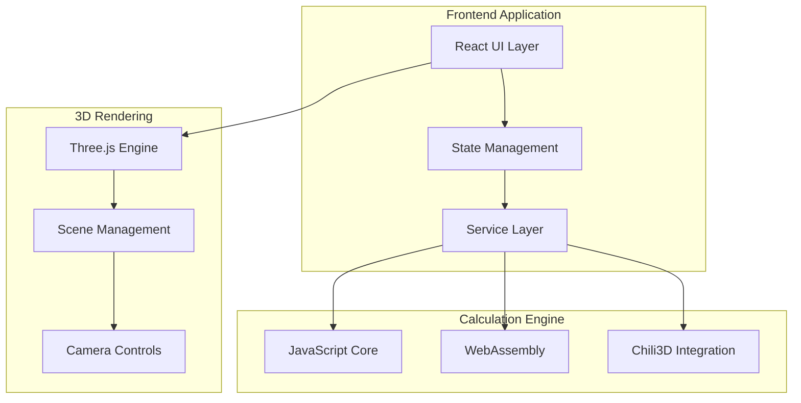

# Land Visualizer Developer Guide
**Complete Technical Guide for Development & Integration**  
*Version 1.0 | For Developers Working with Land Visualizer*

---

## 🎯 Introduction

This guide provides comprehensive technical documentation for developers working on Land Visualizer, integrating with it, or extending its capabilities. Whether you're contributing to the core project, building plugins, or integrating the Chili3D CAD engine, this guide has you covered.

### Guide Structure
- **Getting Started**: Environment setup and first contribution
- **Architecture**: System design and patterns
- **Core Development**: Working with the codebase
- **Chili3D Integration**: Professional CAD features
- **API Reference**: Service interfaces and data contracts
- **Testing**: Quality assurance strategies
- **Performance**: Optimization techniques
- **Deployment**: CI/CD and production

---

## 🚀 Getting Started

### Development Environment Setup

#### Prerequisites
```bash
# Required versions
node >= 18.0.0
npm >= 9.0.0
git >= 2.30.0

# Optional but recommended
VS Code >= 1.80.0
Chrome >= 116.0
```

#### Initial Setup
```bash
# 1. Clone the repository
git clone https://github.com/landvisualizer/land-visualizer.git
cd land-visualizer

# 2. Install dependencies
npm install

# 3. Setup environment variables
cp .env.example .env.local
# Edit .env.local with your configuration

# 4. Build WebAssembly modules (if working with Chili3D)
npm run wasm:setup
npm run wasm:build

# 5. Start development server
npm run dev

# Open http://localhost:3000
```

#### VS Code Configuration
```json
// .vscode/settings.json
{
  "editor.formatOnSave": true,
  "editor.defaultFormatter": "esbenp.prettier-vscode",
  "editor.codeActionsOnSave": {
    "source.fixAll.eslint": true
  },
  "typescript.tsdk": "node_modules/typescript/lib",
  "typescript.enablePromptUseWorkspaceTsdk": true
}
```

### Project Structure Overview
```
land-visualizer/
├── src/
│   ├── components/        # React components
│   │   ├── core/          # Essential UI components
│   │   ├── drawing/       # Drawing tools
│   │   ├── visualization/ # 3D rendering
│   │   └── comparison/    # Comparison features
│   ├── services/          # Business logic
│   │   ├── core/          # Core calculations
│   │   ├── precision/     # Chili3D integration
│   │   └── export/        # Export functionality
│   ├── hooks/            # Custom React hooks
│   ├── integrations/     # External integrations
│   │   └── chili3d/      # Chili3D modules
│   ├── store/            # State management
│   ├── utils/            # Utility functions
│   ├── types/            # TypeScript definitions
│   └── wasm/             # WebAssembly modules
├── tests/                # Test suites
├── public/              # Static assets
└── docs/                # Documentation
```

---

## 🏗️ Architecture Overview

### System Architecture



### Key Design Patterns

#### 1. **Service Layer Pattern**
```typescript
// services/core/CalculationService.ts
export class CalculationService {
  private static instance: CalculationService;
  private calculator: ICalculator;
  
  private constructor() {
    this.calculator = this.initCalculator();
  }
  
  static getInstance(): CalculationService {
    if (!this.instance) {
      this.instance = new CalculationService();
    }
    return this.instance;
  }
  
  async calculateArea(points: Point[]): Promise<CalculationResult> {
    // Validate input
    const validated = this.validatePoints(points);
    
    // Choose calculation method
    const method = await this.selectMethod();
    
    // Perform calculation
    return method.calculate(validated);
  }
  
  private async selectMethod(): Promise<ICalculator> {
    if (await this.isPrecisionAvailable()) {
      return new PrecisionCalculator();
    }
    return new StandardCalculator();
  }
}
```

#### 2. **Component Composition Pattern**
```typescript
// components/drawing/DrawingCanvas.tsx
export const DrawingCanvas: React.FC<DrawingCanvasProps> = ({
  onShapeComplete,
  options = defaultOptions
}) => {
  // Compose functionality with hooks
  const { points, addPoint, removePoint } = useDrawing();
  const { area, perimeter } = useCalculations(points);
  const { camera, controls } = useThree();
  
  // Render with composition
  return (
    <Canvas>
      <DrawingProvider value={{ points, addPoint }}>
        <Grid visible={options.showGrid} />
        <ShapeRenderer points={points} />
        <MeasurementOverlay area={area} perimeter={perimeter} />
        <InteractionLayer onShapeComplete={onShapeComplete} />
      </DrawingProvider>
    </Canvas>
  );
};
```

#### 3. **Strategy Pattern for Calculations**
```typescript
// services/strategies/CalculationStrategy.ts
interface CalculationStrategy {
  calculate(points: Point[]): number;
  validate(points: Point[]): boolean;
}

class ShoelaceStrategy implements CalculationStrategy {
  calculate(points: Point[]): number {
    // Shoelace formula implementation
    let area = 0;
    for (let i = 0; i < points.length; i++) {
      const j = (i + 1) % points.length;
      area += points[i].x * points[j].y;
      area -= points[j].x * points[i].y;
    }
    return Math.abs(area) / 2;
  }
  
  validate(points: Point[]): boolean {
    return points.length >= 3;
  }
}

class MonteCarloStrategy implements CalculationStrategy {
  calculate(points: Point[]): number {
    // Monte Carlo method for complex shapes
    // Implementation...
  }
  
  validate(points: Point[]): boolean {
    return points.length >= 3 && !this.hasSelfintersection(points);
  }
}
```

---

## 💻 Core Development

### React Component Guidelines

#### Component Structure
```typescript
// components/ExampleComponent.tsx
import React, { useState, useCallback, useMemo } from 'react';
import styles from './ExampleComponent.module.css';

interface ExampleComponentProps {
  data: DataType;
  onUpdate: (newData: DataType) => void;
  options?: ComponentOptions;
}

export const ExampleComponent: React.FC<ExampleComponentProps> = React.memo(({
  data,
  onUpdate,
  options = defaultOptions
}) => {
  // State management
  const [localState, setLocalState] = useState(initialState);
  
  // Memoized calculations
  const processedData = useMemo(() => {
    return expensiveProcessing(data);
  }, [data]);
  
  // Callbacks
  const handleChange = useCallback((event: ChangeEvent) => {
    const newValue = event.target.value;
    setLocalState(newValue);
    onUpdate(newValue);
  }, [onUpdate]);
  
  // Effects
  useEffect(() => {
    // Side effects here
    return () => {
      // Cleanup
    };
  }, [dependency]);
  
  // Render
  return (
    <div className={styles.container}>
      {/* Component JSX */}
    </div>
  );
});

ExampleComponent.displayName = 'ExampleComponent';
```

### State Management with Zustand

```typescript
// store/useAppStore.ts
import { create } from 'zustand';
import { subscribeWithSelector } from 'zustand/middleware';
import { devtools } from 'zustand/middleware';

interface AppState {
  // State
  shapes: Shape[];
  selectedShape: Shape | null;
  drawingMode: DrawingMode;
  calculations: CalculationResults;
  
  // Actions
  addShape: (shape: Shape) => void;
  selectShape: (id: string) => void;
  updateCalculations: (results: CalculationResults) => void;
  setDrawingMode: (mode: DrawingMode) => void;
}

export const useAppStore = create<AppState>()(
  devtools(
    subscribeWithSelector((set, get) => ({
      // Initial state
      shapes: [],
      selectedShape: null,
      drawingMode: DrawingMode.None,
      calculations: {},
      
      // Actions
      addShape: (shape) => set((state) => ({
        shapes: [...state.shapes, shape],
        selectedShape: shape
      })),
      
      selectShape: (id) => set((state) => ({
        selectedShape: state.shapes.find(s => s.id === id) || null
      })),
      
      updateCalculations: (results) => set({
        calculations: results
      }),
      
      setDrawingMode: (mode) => set({
        drawingMode: mode
      })
    }))
  )
);

// Selective subscriptions
export const useShapes = () => useAppStore(state => state.shapes);
export const useSelectedShape = () => useAppStore(state => state.selectedShape);
export const useDrawingMode = () => useAppStore(state => state.drawingMode);
```

### Three.js Integration

```typescript
// components/visualization/Scene3D.tsx
import { Canvas, useFrame, useThree } from '@react-three/fiber';
import { OrbitControls, Grid, Stats } from '@react-three/drei';
import * as THREE from 'three';

export const Scene3D: React.FC<Scene3DProps> = ({ shapes, options }) => {
  return (
    <Canvas
      camera={{ position: [0, 50, 100], fov: 60 }}
      gl={{ antialias: true, alpha: true }}
      onCreated={({ gl }) => {
        gl.shadowMap.enabled = true;
        gl.shadowMap.type = THREE.PCFSoftShadowMap;
      }}
    >
      <ambientLight intensity={0.5} />
      <directionalLight position={[10, 10, 5]} intensity={1} />
      
      <Grid
        args={[1000, 1000]}
        cellSize={10}
        cellThickness={0.5}
        cellColor="#6f6f6f"
        sectionSize={100}
        sectionThickness={1}
        sectionColor="#9d4b4b"
        fadeDistance={400}
        fadeStrength={1}
        followCamera={false}
      />
      
      {shapes.map(shape => (
        <ShapeMesh key={shape.id} shape={shape} />
      ))}
      
      <ComparisonObjects />
      <OrbitControls enableDamping dampingFactor={0.05} />
      {options.showStats && <Stats />}
    </Canvas>
  );
};

// Custom shape mesh component
const ShapeMesh: React.FC<{ shape: Shape }> = ({ shape }) => {
  const meshRef = useRef<THREE.Mesh>();
  
  // Create geometry from points
  const geometry = useMemo(() => {
    const shape3d = new THREE.Shape();
    shape.points.forEach((point, index) => {
      if (index === 0) {
        shape3d.moveTo(point.x, point.y);
      } else {
        shape3d.lineTo(point.x, point.y);
      }
    });
    shape3d.closePath();
    
    return new THREE.ExtrudeGeometry(shape3d, {
      depth: 0.1,
      bevelEnabled: false
    });
  }, [shape.points]);
  
  // Animate on hover
  useFrame((state) => {
    if (meshRef.current && meshRef.current.userData.hovered) {
      meshRef.current.position.y = Math.sin(state.clock.elapsedTime) * 0.5;
    }
  });
  
  return (
    <mesh
      ref={meshRef}
      geometry={geometry}
      onPointerOver={() => meshRef.current.userData.hovered = true}
      onPointerOut={() => meshRef.current.userData.hovered = false}
    >
      <meshStandardMaterial color="#00ff00" />
    </mesh>
  );
};
```

---

## 🎯 Chili3D Integration

### Overview
Chili3D provides professional-grade CAD capabilities through WebAssembly, enabling survey-grade precision and advanced geometric operations.

### Integration Architecture
```
Application Layer
      ↓
Adapter/Facade Layer (TypeScript)
      ↓
Chili3D API Layer (TypeScript/C++)
      ↓
WebAssembly Core (Compiled C++)
      ↓
OpenCascade Engine (Native)
```

### Setting Up Chili3D

#### 1. Install Dependencies
```bash
# Core Chili3D packages
npm install @chili3d/core @chili3d/geometry @chili3d/io

# Build tools for WASM
npm install --save-dev emscripten wasm-opt
```

#### 2. Configure WebAssembly Build
```javascript
// scripts/build-wasm.js
const { execSync } = require('child_process');
const fs = require('fs');
const path = require('path');

const buildWasm = () => {
  console.log('Building WASM modules...');
  
  // Compile C++ to WASM
  execSync(`
    emcc src/wasm/geometry.cpp 
    -o public/wasm/geometry.wasm 
    -O3 
    -s EXPORTED_FUNCTIONS='["_calculateArea", "_validatePolygon", "_subdivide"]'
    -s EXPORTED_RUNTIME_METHODS='["ccall", "cwrap"]'
    -s ALLOW_MEMORY_GROWTH=1
    -s MAXIMUM_MEMORY=512MB
  `);
  
  // Optimize WASM
  execSync(`
    wasm-opt public/wasm/geometry.wasm 
    -O3 
    --enable-simd 
    -o public/wasm/geometry.opt.wasm
  `);
  
  console.log('WASM build complete!');
};

buildWasm();
```

### Implementing Precision Calculator

```typescript
// integrations/chili3d/PrecisionCalculator.ts
import { ChiliGeometry, ChiliValidator } from '@chili3d/geometry';
import { WasmLoader } from './WasmLoader';

export class PrecisionCalculator {
  private geometry: ChiliGeometry;
  private validator: ChiliValidator;
  private wasm: WasmModule | null = null;
  
  async initialize(): Promise<void> {
    // Initialize Chili3D
    this.geometry = new ChiliGeometry();
    this.validator = new ChiliValidator();
    
    // Load WASM module
    try {
      this.wasm = await WasmLoader.load('/wasm/geometry.wasm');
      console.log('WASM module loaded successfully');
    } catch (error) {
      console.warn('WASM unavailable, using fallback');
    }
  }
  
  async calculateArea(points: Point[]): Promise<PrecisionResult> {
    const startTime = performance.now();
    
    // Validate input
    const validation = this.validator.validatePolygon(points);
    if (!validation.isValid) {
      throw new ValidationError(validation.errors);
    }
    
    let area: number;
    let method: CalculationMethod;
    
    // Try WASM first for best performance
    if (this.wasm && points.length > 100) {
      area = await this.calculateWithWasm(points);
      method = 'wasm';
    }
    // Use Chili3D for moderate complexity
    else if (points.length > 20) {
      area = await this.calculateWithChili3D(points);
      method = 'chili3d';
    }
    // Fallback to JavaScript for simple shapes
    else {
      area = this.calculateWithJS(points);
      method = 'javascript';
    }
    
    const endTime = performance.now();
    
    return {
      area,
      precision: this.getPrecision(method),
      confidence: this.getConfidence(points, method),
      calculationTime: endTime - startTime,
      method
    };
  }
  
  private async calculateWithWasm(points: Point[]): Promise<number> {
    // Flatten points array for WASM
    const flatArray = new Float32Array(points.length * 2);
    points.forEach((point, i) => {
      flatArray[i * 2] = point.x;
      flatArray[i * 2 + 1] = point.y;
    });
    
    // Allocate memory in WASM
    const ptr = this.wasm._malloc(flatArray.byteLength);
    this.wasm.HEAPF32.set(flatArray, ptr / 4);
    
    // Call WASM function
    const area = this.wasm._calculateArea(ptr, points.length);
    
    // Free memory
    this.wasm._free(ptr);
    
    return area;
  }
  
  private async calculateWithChili3D(points: Point[]): Promise<number> {
    // Convert to Chili3D format
    const chiliPolygon = this.geometry.createPolygon(
      points.map(p => ({ x: p.x, y: p.y, z: 0 }))
    );
    
    // Use Chili3D's high-precision calculation
    return this.geometry.calculateArea(chiliPolygon);
  }
  
  private calculateWithJS(points: Point[]): number {
    // Shoelace formula fallback
    let area = 0;
    for (let i = 0; i < points.length; i++) {
      const j = (i + 1) % points.length;
      area += points[i].x * points[j].y;
      area -= points[j].x * points[i].y;
    }
    return Math.abs(area) / 2;
  }
  
  private getPrecision(method: CalculationMethod): number {
    switch (method) {
      case 'wasm': return 0.0001;     // ±0.01%
      case 'chili3d': return 0.0001;  // ±0.01%
      case 'javascript': return 0.01; // ±1%
      default: return 0.01;
    }
  }
  
  private getConfidence(points: Point[], method: CalculationMethod): number {
    // Calculate confidence based on shape complexity and method
    const complexity = this.calculateComplexity(points);
    const methodScore = method === 'wasm' ? 1.0 : method === 'chili3d' ? 0.95 : 0.8;
    return Math.min(1.0, methodScore * (1 - complexity * 0.1));
  }
  
  private calculateComplexity(points: Point[]): number {
    // Simple complexity metric based on vertex count and irregularity
    const vertexScore = Math.min(points.length / 100, 1);
    const irregularityScore = this.calculateIrregularity(points);
    return (vertexScore + irregularityScore) / 2;
  }
}
```

### Boolean Operations Implementation

```typescript
// integrations/chili3d/BooleanOperations.ts
import { ChiliBoolean, ChiliShape } from '@chili3d/geometry';

export class BooleanOperations {
  private boolean: ChiliBoolean;
  
  constructor() {
    this.boolean = new ChiliBoolean();
  }
  
  /**
   * Subdivide a property along a division line
   */
  async subdivide(
    property: Shape,
    divisionLine: Line
  ): Promise<SubdivisionResult> {
    // Convert to Chili3D shapes
    const propertyShape = this.toChiliShape(property);
    const divisionShape = this.createDivisionShape(divisionLine, property);
    
    // Perform boolean operations
    const leftSide = await this.boolean.difference(
      propertyShape,
      divisionShape
    );
    
    const rightSide = await this.boolean.intersection(
      propertyShape,
      divisionShape
    );
    
    // Convert back to application format
    return {
      parcels: [
        this.fromChiliShape(leftSide),
        this.fromChiliShape(rightSide)
      ],
      areas: [
        leftSide.getArea(),
        rightSide.getArea()
      ],
      valid: this.validateSubdivision(property, [leftSide, rightSide])
    };
  }
  
  /**
   * Calculate setback area from property boundaries
   */
  async calculateSetback(
    property: Shape,
    distance: number
  ): Promise<SetbackResult> {
    const propertyShape = this.toChiliShape(property);
    
    // Create inset shape
    const setbackShape = await this.boolean.offset(
      propertyShape,
      -distance,
      {
        joinType: 'round',
        endType: 'closedPolygon',
        miterLimit: 2.0
      }
    );
    
    return {
      buildableArea: this.fromChiliShape(setbackShape),
      setbackArea: property.area - setbackShape.getArea(),
      compliant: setbackShape.getArea() > 0
    };
  }
  
  /**
   * Merge adjacent properties
   */
  async mergeProperties(properties: Shape[]): Promise<Shape> {
    if (properties.length < 2) {
      throw new Error('Need at least 2 properties to merge');
    }
    
    let merged = this.toChiliShape(properties[0]);
    
    for (let i = 1; i < properties.length; i++) {
      const next = this.toChiliShape(properties[i]);
      merged = await this.boolean.union(merged, next);
    }
    
    return this.fromChiliShape(merged);
  }
  
  private toChiliShape(shape: Shape): ChiliShape {
    return new ChiliShape(
      shape.points.map(p => ({ x: p.x, y: p.y, z: 0 }))
    );
  }
  
  private fromChiliShape(chiliShape: ChiliShape): Shape {
    return {
      id: generateId(),
      points: chiliShape.getVertices().map(v => ({ x: v.x, y: v.y })),
      area: chiliShape.getArea(),
      perimeter: chiliShape.getPerimeter(),
      closed: true
    };
  }
  
  private createDivisionShape(line: Line, property: Shape): ChiliShape {
    // Create a shape that divides the property
    const bbox = this.getBoundingBox(property);
    const extended = this.extendLine(line, bbox);
    
    // Create a thin rectangle along the line
    const thickness = 0.01; // 1cm
    return this.createRectangleFromLine(extended, thickness);
  }
}
```

---

## 🧪 Testing Strategy

### Unit Testing

```typescript
// tests/unit/services/CalculationService.test.ts
import { CalculationService } from '@/services/core/CalculationService';
import { mockPoints } from '../fixtures/shapes';

describe('CalculationService', () => {
  let service: CalculationService;
  
  beforeEach(() => {
    service = CalculationService.getInstance();
  });
  
  afterEach(() => {
    jest.clearAllMocks();
  });
  
  describe('calculateArea', () => {
    it('should calculate square area correctly', async () => {
      const square = mockPoints.square(100);
      const result = await service.calculateArea(square);
      
      expect(result.value).toBe(10000);
      expect(result.unit).toBe('m2');
      expect(result.precision).toBeLessThanOrEqual(0.01);
    });
    
    it('should handle complex polygons', async () => {
      const complex = mockPoints.complexPolygon();
      const result = await service.calculateArea(complex);
      
      expect(result.value).toBeGreaterThan(0);
      expect(result.confidence).toBeGreaterThan(0.8);
    });
    
    it('should fall back gracefully when WASM unavailable', async () => {
      jest.spyOn(WebAssembly, 'instantiate').mockRejectedValue(
        new Error('WASM not supported')
      );
      
      const result = await service.calculateArea(mockPoints.square(100));
      
      expect(result.method).toBe('javascript');
      expect(result.value).toBeCloseTo(10000, 1);
    });
  });
});
```

### Integration Testing

```typescript
// tests/integration/drawing-calculation-flow.test.tsx
import { render, fireEvent, waitFor } from '@testing-library/react';
import { App } from '@/App';

describe('Drawing to Calculation Flow', () => {
  it('should complete full workflow', async () => {
    const { getByTestId, getByText } = render(<App />);
    
    // Start drawing
    const drawButton = getByTestId('draw-tool');
    fireEvent.click(drawButton);
    
    // Draw shape
    const canvas = getByTestId('drawing-canvas');
    fireEvent.click(canvas, { clientX: 100, clientY: 100 });
    fireEvent.click(canvas, { clientX: 200, clientY: 100 });
    fireEvent.click(canvas, { clientX: 200, clientY: 200 });
    fireEvent.click(canvas, { clientX: 100, clientY: 200 });
    
    // Complete shape
    fireEvent.keyDown(canvas, { key: 'Enter' });
    
    // Wait for calculations
    await waitFor(() => {
      expect(getByText(/Area: 10,000/)).toBeInTheDocument();
      expect(getByText(/Perimeter: 400/)).toBeInTheDocument();
    });
    
    // Add comparison
    const compareButton = getByTestId('compare-tool');
    fireEvent.click(compareButton);
    
    const soccerField = getByText('Soccer Field');
    fireEvent.click(soccerField);
    
    // Verify comparison
    await waitFor(() => {
      expect(getByText(/1.4 soccer fields/)).toBeInTheDocument();
    });
  });
});
```

### E2E Testing with Cypress

```typescript
// tests/e2e/professional-workflow.cy.ts
describe('Professional Workflow', () => {
  beforeEach(() => {
    cy.visit('/');
    cy.waitForApp();
  });
  
  it('should complete professional survey workflow', () => {
    // Enable precision mode
    cy.get('[data-cy=settings]').click();
    cy.get('[data-cy=precision-toggle]').click();
    cy.get('[data-cy=settings-close]').click();
    
    // Input precise coordinates
    cy.get('[data-cy=coordinate-input]').click();
    
    // Enter survey data
    const surveyPoints = [
      { x: 0, y: 0 },
      { x: 45.72, y: 0 },
      { x: 45.72, y: 32.46 },
      { x: 0, y: 32.46 }
    ];
    
    surveyPoints.forEach((point, index) => {
      cy.get(`[data-cy=point-${index}-x]`).type(point.x.toString());
      cy.get(`[data-cy=point-${index}-y]`).type(point.y.toString());
    });
    
    cy.get('[data-cy=generate-shape]').click();
    
    // Verify precision calculation
    cy.contains('Area: 1,484.071 m²').should('be.visible');
    cy.contains('Precision: ±0.01%').should('be.visible');
    
    // Calculate setbacks
    cy.get('[data-cy=tools]').click();
    cy.get('[data-cy=setback-calculator]').click();
    cy.get('[data-cy=setback-distance]').type('5');
    cy.get('[data-cy=calculate-setback]').click();
    
    // Verify setback
    cy.contains('Buildable Area:').should('be.visible');
    cy.get('[data-cy=setback-overlay]').should('be.visible');
    
    // Export to CAD
    cy.get('[data-cy=export]').click();
    cy.get('[data-cy=export-dxf]').click();
    
    // Verify download
    cy.readFile('cypress/downloads/property.dxf').should('exist');
  });
});
```

---

## ⚡ Performance Optimization

### Bundle Optimization

```javascript
// vite.config.ts
import { defineConfig, splitVendorChunkPlugin } from 'vite';
import react from '@vitejs/plugin-react';
import { visualizer } from 'rollup-plugin-visualizer';

export default defineConfig({
  plugins: [
    react(),
    splitVendorChunkPlugin(),
    visualizer({
      filename: 'dist/stats.html',
      open: false,
      gzipSize: true,
      brotliSize: true
    })
  ],
  build: {
    target: 'es2020',
    minify: 'terser',
    rollupOptions: {
      output: {
        manualChunks: (id) => {
          if (id.includes('three')) return 'three';
          if (id.includes('@chili3d')) return 'chili3d';
          if (id.includes('react')) return 'react';
          if (id.includes('node_modules')) return 'vendor';
        }
      }
    },
    terserOptions: {
      compress: {
        drop_console: true,
        drop_debugger: true,
        pure_funcs: ['console.log']
      }
    }
  }
});
```

### Runtime Performance

```typescript
// hooks/useOptimizedRendering.ts
import { useCallback, useRef, useEffect } from 'react';
import { useFrame } from '@react-three/fiber';

export function useOptimizedRendering() {
  const renderCount = useRef(0);
  const lastRenderTime = useRef(0);
  
  // Throttle expensive operations
  const throttle = useCallback((fn: Function, ms: number) => {
    let lastCall = 0;
    return (...args: any[]) => {
      const now = Date.now();
      if (now - lastCall >= ms) {
        lastCall = now;
        return fn(...args);
      }
    };
  }, []);
  
  // Adaptive quality based on performance
  useFrame((state, delta) => {
    renderCount.current++;
    const now = performance.now();
    
    if (now - lastRenderTime.current >= 1000) {
      const fps = renderCount.current;
      
      // Adjust quality based on FPS
      if (fps < 30) {
        state.gl.setPixelRatio(1);
        state.scene.traverse((child) => {
          if (child.type === 'Mesh') {
            child.material.wireframe = true;
          }
        });
      } else if (fps > 50) {
        state.gl.setPixelRatio(window.devicePixelRatio);
        state.scene.traverse((child) => {
          if (child.type === 'Mesh') {
            child.material.wireframe = false;
          }
        });
      }
      
      renderCount.current = 0;
      lastRenderTime.current = now;
    }
  });
  
  return { throttle };
}
```

---

## 🚀 Deployment

### CI/CD Pipeline

```yaml
# .github/workflows/deploy.yml
name: Deploy Pipeline

on:
  push:
    branches: [main, develop]
  pull_request:
    branches: [main]

jobs:
  test:
    runs-on: ubuntu-latest
    steps:
      - uses: actions/checkout@v3
      - uses: actions/setup-node@v3
        with:
          node-version: '18'
          cache: 'npm'
      
      - name: Install dependencies
        run: npm ci
      
      - name: Run tests
        run: |
          npm run test:unit
          npm run test:integration
      
      - name: Upload coverage
        uses: codecov/codecov-action@v3

  build:
    needs: test
    runs-on: ubuntu-latest
    steps:
      - uses: actions/checkout@v3
      
      - name: Setup Node
        uses: actions/setup-node@v3
        with:
          node-version: '18'
      
      - name: Install dependencies
        run: npm ci
      
      - name: Build WASM
        run: |
          npm run wasm:compile
          npm run wasm:optimize
      
      - name: Build application
        run: npm run build:prod
        env:
          VITE_APP_VERSION: ${{ github.sha }}
      
      - name: Upload artifacts
        uses: actions/upload-artifact@v3
        with:
          name: build-artifacts
          path: dist/

  deploy:
    needs: build
    if: github.ref == 'refs/heads/main'
    runs-on: ubuntu-latest
    steps:
      - name: Download artifacts
        uses: actions/download-artifact@v3
        with:
          name: build-artifacts
          path: dist/
      
      - name: Deploy to production
        run: |
          npx netlify deploy \
            --dir=dist \
            --prod \
            --site=${{ secrets.NETLIFY_SITE_ID }} \
            --auth=${{ secrets.NETLIFY_AUTH_TOKEN }}
```

### Production Configuration

```typescript
// config/production.ts
export const productionConfig = {
  api: {
    baseUrl: 'https://api.landvisualizer.com',
    timeout: 30000,
    retries: 3
  },
  
  features: {
    precisionMode: true,
    wasmEnabled: true,
    analytics: true,
    errorTracking: true
  },
  
  performance: {
    bundleSizeLimit: 5 * 1024 * 1024, // 5MB
    initialLoadTarget: 3000, // 3s
    fpsTarget: 60,
    memoryLimit: 512 * 1024 * 1024 // 512MB
  },
  
  security: {
    csp: {
      'default-src': ["'self'"],
      'script-src': ["'self'", "'wasm-unsafe-eval'"],
      'style-src': ["'self'", "'unsafe-inline'"],
      'img-src': ["'self'", "data:", "blob:", "https:"],
      'connect-src': ["'self'", "https://api.landvisualizer.com"]
    }
  },
  
  monitoring: {
    sentry: {
      dsn: process.env.VITE_SENTRY_DSN,
      environment: 'production',
      tracesSampleRate: 0.1
    }
  }
};
```

---

## 📚 API Reference

### Core Services

```typescript
// Service interfaces for external integration

export interface ICalculationService {
  calculateArea(points: Point[]): Promise<CalculationResult>;
  calculatePerimeter(points: Point[]): Promise<number>;
  validateShape(points: Point[]): Promise<ValidationResult>;
}

export interface IDrawingService {
  startDrawing(canvas: HTMLCanvasElement): DrawingSession;
  addPoint(point: Point, session: DrawingSession): void;
  completeShape(session: DrawingSession): Shape;
  editShape(shape: Shape, changes: ShapeChanges): Shape;
}

export interface IExportService {
  exportImage(canvas: HTMLCanvasElement, format: ImageFormat): Promise<Blob>;
  exportPDF(data: ExportData): Promise<Blob>;
  exportCAD(shape: Shape, format: CADFormat): Promise<Blob>;
}

export interface IComparisonService {
  getComparisonObjects(): ComparisonObject[];
  calculateFit(area: number, objectId: string): FitResult;
  addCustomObject(object: CustomObject): void;
}
```

### Plugin System

```typescript
// plugins/PluginSystem.ts
export interface Plugin {
  name: string;
  version: string;
  initialize(context: PluginContext): void;
  destroy(): void;
}

export interface PluginContext {
  services: {
    calculation: ICalculationService;
    drawing: IDrawingService;
    export: IExportService;
  };
  
  ui: {
    addToolbarButton(button: ToolbarButton): void;
    addMenuItem(item: MenuItem): void;
    addPanel(panel: Panel): void;
  };
  
  events: EventEmitter;
  
  store: {
    getState(): AppState;
    setState(partial: Partial<AppState>): void;
    subscribe(listener: StateListener): Unsubscribe;
  };
}

// Example plugin
export class MeasurementPlugin implements Plugin {
  name = 'Advanced Measurements';
  version = '1.0.0';
  
  initialize(context: PluginContext) {
    // Add toolbar button
    context.ui.addToolbarButton({
      id: 'measure-angle',
      icon: 'angle',
      tooltip: 'Measure angles',
      onClick: this.handleMeasureAngle
    });
    
    // Subscribe to shape changes
    context.store.subscribe((state) => {
      if (state.selectedShape) {
        this.updateMeasurements(state.selectedShape);
      }
    });
  }
  
  private handleMeasureAngle = () => {
    // Implementation
  };
  
  private updateMeasurements(shape: Shape) {
    // Calculate additional measurements
  }
  
  destroy() {
    // Cleanup
  }
}
```

---

## 🔒 Security Best Practices

### Input Validation

```typescript
// security/validation.ts
export class SecurityValidator {
  static validateUserInput<T>(
    input: unknown,
    schema: Schema<T>
  ): T {
    // Validate against schema
    const validated = schema.parse(input);
    
    // Additional security checks
    if (typeof validated === 'string') {
      // Prevent XSS
      return DOMPurify.sanitize(validated) as T;
    }
    
    if (Array.isArray(validated)) {
      // Limit array size to prevent DoS
      if (validated.length > 10000) {
        throw new SecurityError('Input exceeds maximum size');
      }
    }
    
    return validated;
  }
  
  static validateCoordinate(coord: unknown): number {
    if (typeof coord !== 'number') {
      throw new ValidationError('Coordinate must be a number');
    }
    
    // Prevent overflow
    if (!isFinite(coord) || Math.abs(coord) > 1e6) {
      throw new ValidationError('Coordinate out of range');
    }
    
    // Round to prevent precision attacks
    return Math.round(coord * 1000) / 1000;
  }
  
  static sanitizeFileName(filename: string): string {
    // Remove path traversal attempts
    return filename
      .replace(/\.\./g, '')
      .replace(/[\/\\]/g, '')
      .replace(/[^a-zA-Z0-9\-_.]/g, '_')
      .slice(0, 255);
  }
}
```

---

## 📖 Additional Resources

### Documentation
- [API Documentation](./API.md)
- [Architecture Overview](./ARCHITECTURE.md)
- [Testing Guide](./TESTING.md)
- [Performance Guide](./PERFORMANCE.md)
- [Security Guide](./SECURITY.md)

### External Resources
- [React Documentation](https://react.dev)
- [Three.js Documentation](https://threejs.org/docs)
- [Chili3D Documentation](https://docs.chili3d.com)
- [TypeScript Handbook](https://www.typescriptlang.org/docs)
- [WebAssembly Guide](https://webassembly.org/docs)

### Community
- [GitHub Discussions](https://github.com/landvisualizer/discussions)
- [Discord Server](https://discord.gg/landviz)
- [Stack Overflow Tag](https://stackoverflow.com/questions/tagged/land-visualizer)

---

**Thank you for contributing to Land Visualizer!**  
*Making land visualization accessible to everyone*

**Version**: 1.0.0  
**Last Updated**: November 30, 2025  
**Maintained by**: Land Visualizer Development Team