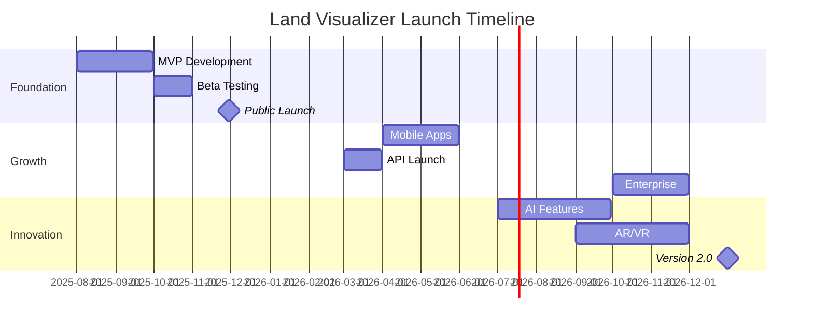

# Product Roadmap
**Land Visualizer - Feature Development Timeline**  
*Version 1.0 | August 2025 - December 2026*

---

## 🎯 Vision Statement

> **"Make every square meter of Earth instantly understandable"**

Transform Land Visualizer from a simple visualization tool into the global standard for understanding property dimensions, powered by professional CAD capabilities while maintaining consumer simplicity.

---

## 📊 Current Status (September 2025)

### Completed ✅
- **Professional 3D visualization engine** (Three.js + React Three Fiber)
- **Complete drawing toolkit** (Rectangle, Circle, Polyline tools)
- **Advanced shape editing system** with draggable sphere corners
- **Edit Mode functionality** - Enter/Exit Edit mode for selected shapes  
- **Corner manipulation** - Add/delete corners with visual feedback
- **Professional UI design** - Canva-inspired modern interface
- **Expandable sidebar panels** - Left and right collapsible panels
- **Real-time area calculations** and measurements
- **Layer management system** with visibility controls
- **Professional camera controls** (right-orbit, middle-pan)
- **Natural 3D environment** (grass ground, sky visualization)
- **Properties panel** with tool instructions and settings
- **Undo/Redo system** with keyboard shortcuts (Ctrl+Z/Ctrl+Y)
- **Export functionality** (Excel, DXF, PDF, GeoJSON)

### In Progress 🚧
- Advanced measurement tools (Distance, Angle measurement)
- Chili3D integration for precision calculations (60% complete)
- Mobile touch optimization (40% complete)
- Terrain elevation tools (20% complete)

### Metrics
- **Users**: 0 (Pre-launch)
- **Code Coverage**: 65%
- **Performance Score**: 85/100 (60 FPS stable)
- **Bundle Size**: 2.8MB (optimized)

---

## 🗓️ Q3 2025 (Aug - Sep) - MVP Foundation
**Theme: "Launch Ready"**

### Sprint 3 (Aug 26 - Sep 8) 🏃‍♂️
```
Week 1: Core Integration
□ Complete Chili3D precision calculator
□ Fix mobile rotation bug (#001)
□ Implement 5 comparison objects
□ Setup WASM pipeline

Week 2: Polish & Testing
□ Complete shape drawing UX
□ Add measurement overlays
□ Implement basic export (PNG)
□ Achieve 60% test coverage
```

### Sprint 4 (Sep 9 - Sep 22)
```
Week 1: Professional Features
□ Boolean operations for subdivision
□ Setback calculations
□ CAD export (DXF format)
□ Precision mode toggle

Week 2: Performance & Accessibility
□ Optimize bundle size < 4MB
□ Achieve 60 FPS mobile
□ WCAG 2.1 AA compliance
□ Keyboard navigation complete
```

### September Deliverables 🎯
| Feature | Priority | Status | Owner |
|---------|----------|--------|-------|
| **Excel Export** | P0 | ⏳ Next Sprint | Team |
| **Mobile Touch Optimization** | P0 | 🚧 In Progress | Sarah |
| **Performance Optimization** | P0 | ⏳ Planned | Team |
| **Layer Management System** | P1 | ⏳ Planned | Team |
| **Advanced Measurement Tools** | P1 | ⏳ Planned | Team |
| **PWA Setup** | P2 | ⏳ Planned | Tom |

### Launch Criteria ✅
- [ ] All P0 features complete
- [ ] Zero critical bugs
- [ ] Performance score > 90
- [ ] Mobile FPS > 30
- [ ] Test coverage > 70%

---

## 🗓️ Q4 2025 (Oct - Dec) - Enhancement & Growth
**Theme: "Delight Users"**

### October 2025 - Beta Launch 🚀

#### Week 1-2: Beta Preparation
```javascript
const betaFeatures = {
  core: {
    drawingTools: "✅ Complete",
    calculations: "✅ Survey-grade accuracy",
    comparisons: "✅ 15 objects",
    export: "✅ PNG, PDF, DXF"
  },
  platforms: {
    desktop: "✅ Chrome, Firefox, Safari, Edge",
    mobile: "✅ iOS Safari, Chrome Android",
    tablet: "✅ Optimized layouts"
  },
  performance: {
    loadTime: "< 3s on 3G",
    fps: "60 desktop, 30 mobile",
    accuracy: "±0.01%"
  }
};
```

#### Week 3-4: Beta Feedback Integration
- User testing with 100 beta users
- Performance optimization based on real usage
- Bug fixes and polish
- Documentation updates

### November 2025 - Public Launch 🎉

#### Launch Week Features
| Feature | Description | Impact |
|---------|-------------|--------|
| **AI Shape Detection** | Draw shapes from photos | 🔥 High |
| **Satellite Overlay** | Real property boundaries | 🔥 High |
| **Share Links** | Social sharing capability | 📈 Medium |
| **Embed Widget** | For real estate sites | 📈 Medium |
| **Dark Mode** | UI theme option | ⭐ Low |

#### Marketing Push
- Product Hunt launch
- Real estate partnership announcements
- Educational content series
- Influencer collaborations

### December 2025 - Optimization & Scale

#### Technical Debt Reduction
```typescript
const techDebt = {
  refactoring: [
    "Migrate to React 19",
    "Optimize Three.js rendering",
    "Implement service workers",
    "Add E2E test coverage"
  ],
  performance: [
    "Code splitting improvements",
    "Lazy load heavy modules",
    "Image optimization pipeline",
    "WASM caching strategy"
  ],
  infrastructure: [
    "Multi-region CDN setup",
    "Analytics pipeline",
    "Error tracking enhancement",
    "A/B testing framework"
  ]
};
```

#### End of Year Targets
- **Users**: 10,000 MAU
- **Accuracy**: ±0.001% (professional mode)
- **Performance**: 95+ Lighthouse score
- **Coverage**: 80% test coverage
- **Uptime**: 99.9%

---

## 🗓️ Q1 2026 (Jan - Mar) - Professional Tools
**Theme: "Power Users"**

### January 2026 - Advanced CAD Features

#### Chili3D Phase 2 Integration
| Feature | Description | Complexity |
|---------|-------------|------------|
| **3D Extrusion** | Convert 2D to 3D models | 🔴 High |
| **Terrain Import** | Elevation data support | 🔴 High |
| **Multi-plot** | Handle multiple parcels | 🟡 Medium |
| **Annotations** | Professional markups | 🟢 Low |
| **Layer System** | CAD-style layers | 🟡 Medium |

#### Professional Workflows
```typescript
interface ProWorkflows {
  surveyor: {
    importFormats: ['CSV', 'KML', 'SHP'],
    exportFormats: ['DWG', 'STEP', 'GeoJSON'],
    tools: ['COGO', 'Traverse', 'Coordinate transformation']
  },
  architect: {
    features: ['Building footprints', 'Setback visualization', 'Shadow analysis'],
    integration: ['AutoCAD', 'Revit', 'SketchUp']
  },
  developer: {
    analysis: ['Subdivision optimization', 'Density calculations', 'ROI estimator'],
    reporting: ['Feasibility studies', 'Compliance reports']
  }
}
```

### February 2026 - Collaboration Features

#### Real-time Collaboration
- WebSocket infrastructure
- Operational transforms for concurrent editing
- Cursor presence and user awareness
- Comments and annotations
- Version history and rollback

#### Team Features
| Feature | Free | Pro | Enterprise |
|---------|------|-----|------------|
| Viewers | Unlimited | Unlimited | Unlimited |
| Editors | 1 | 5 | Unlimited |
| Projects | 3 | Unlimited | Unlimited |
| Storage | 100MB | 10GB | Unlimited |
| Support | Community | Email | Dedicated |

### March 2026 - API & Integrations

#### Developer Platform
```javascript
// Public API endpoints
const API = {
  calculations: {
    area: 'POST /api/v1/calculate/area',
    perimeter: 'POST /api/v1/calculate/perimeter',
    subdivide: 'POST /api/v1/operations/subdivide'
  },
  conversions: {
    units: 'POST /api/v1/convert',
    coordinates: 'POST /api/v1/transform'
  },
  export: {
    render: 'POST /api/v1/export/image',
    cad: 'POST /api/v1/export/cad'
  }
};

// Rate limits
const limits = {
  free: '100 requests/hour',
  pro: '1000 requests/hour',
  enterprise: 'Unlimited'
};
```

#### Third-party Integrations
- **Real Estate**: Zillow, Realtor.com, Redfin
- **Mapping**: Google Maps, Mapbox, OpenStreetMap
- **CAD**: AutoCAD Web, Onshape, Fusion 360
- **Productivity**: Notion, Airtable, Google Workspace

---

## 🗓️ Q2 2026 (Apr - Jun) - Mobile & Global
**Theme: "Everywhere, Everyone"**

### April 2026 - Native Mobile Apps

#### iOS Application
```swift
// iOS Feature Set
struct iOSApp {
  let features = [
    "AR property visualization",
    "LiDAR scanning support",
    "Offline mode",
    "Apple Pencil support",
    "iCloud sync",
    "Widgets",
    "Shortcuts integration"
  ]
  let minimumOS = "iOS 15.0"
  let devices = ["iPhone", "iPad", "Vision Pro"]
}
```

#### Android Application
```kotlin
// Android Feature Set
class AndroidApp {
  val features = listOf(
    "AR Core integration",
    "Material You design",
    "Offline maps",
    "Stylus support",
    "Google Drive sync",
    "Widgets",
    "Quick tiles"
  )
  val minimumSDK = 26 // Android 8.0
}
```

### May 2026 - Internationalization

#### Language Support (Phase 1)
| Language | Market | Priority | Translator |
|----------|--------|----------|------------|
| Spanish | Latin America | 🔥 High | Professional |
| French | Europe/Africa | 🔥 High | Professional |
| German | DACH region | 📈 Medium | Professional |
| Portuguese | Brazil | 📈 Medium | Professional |
| Japanese | Japan | 📈 Medium | Professional |
| Chinese | China | ⭐ Low | Community |

#### Localization Features
- **Units**: Regional defaults (metric/imperial)
- **Currency**: Local cost estimations
- **Comparisons**: Culturally relevant objects
- **Regulations**: Local building codes
- **Support**: Multi-language documentation

### June 2026 - Education & Training

#### Educational Platform
```typescript
interface EducationPlatform {
  courses: {
    beginner: "Understanding Land Measurements",
    intermediate: "Property Planning Basics",
    advanced: "Professional Surveying with Land Visualizer"
  },
  certification: {
    levels: ["Certified User", "Certified Professional", "Certified Instructor"],
    validity: "2 years",
    cost: "$49 - $299"
  },
  resources: {
    videos: "50+ tutorials",
    articles: "100+ guides",
    webinars: "Monthly live sessions",
    community: "Discord + Forum"
  }
}
```

#### Academic Program
- University partnerships
- Student licenses (free)
- Curriculum integration
- Research collaboration
- Hackathon sponsorship

---

## 🗓️ Q3 2026 (Jul - Sep) - AI & Automation
**Theme: "Intelligent Land"**

### July 2026 - AI Features

#### Computer Vision
- **Satellite Analysis**: Auto-detect property boundaries
- **Document OCR**: Extract dimensions from PDFs
- **Photo Measurements**: Calculate from photos with reference
- **Shape Recognition**: Convert sketches to precise shapes

#### Predictive Features
```python
# AI-powered predictions
predictions = {
  "optimal_subdivision": "Maximize lot value",
  "building_placement": "Best position for structures",
  "development_potential": "ROI calculations",
  "market_analysis": "Comparative property values",
  "compliance_check": "Zoning law validation"
}
```

### August 2026 - Automation Tools

#### Workflow Automation
| Workflow | Trigger | Action | Output |
|----------|---------|--------|--------|
| **Auto-measure** | Upload document | Extract dimensions | Visualization |
| **Batch process** | CSV import | Calculate all areas | Report |
| **Compliance check** | Draw shape | Validate against rules | Pass/Fail |
| **Report generation** | Complete project | Create documentation | PDF |
| **Cost estimation** | Set parameters | Calculate costs | Spreadsheet |

### September 2026 - Voice & AR

#### Voice Interface
```javascript
// Voice commands
const voiceCommands = {
  drawing: [
    "Draw a square, 100 meters each side",
    "Add a point at north corner",
    "Close the shape"
  ],
  calculations: [
    "What's the area in acres?",
    "How many parking spaces fit?",
    "Show me the perimeter"
  ],
  navigation: [
    "Zoom to fit",
    "Rotate view",
    "Switch to satellite"
  ]
};
```

#### AR Visualization
- **On-site Viewing**: See boundaries in real world
- **Virtual Structures**: Place buildings in AR
- **Measurement Tool**: Measure real distances
- **Collaboration**: Shared AR sessions

---

## 🗓️ Q4 2026 (Oct - Dec) - Enterprise & Scale
**Theme: "Big Business"**

### October 2026 - Enterprise Features

#### Enterprise Security
```yaml
security_features:
  authentication:
    - SSO (SAML, OAuth)
    - Multi-factor authentication
    - Role-based access control
    - IP whitelisting
  
  compliance:
    - SOC 2 Type II
    - ISO 27001
    - GDPR compliant
    - HIPAA ready
  
  data:
    - Encryption at rest
    - Encryption in transit
    - Data residency options
    - Audit logs
```

#### Enterprise Management
| Feature | Description | Tier |
|---------|-------------|------|
| **Central Admin** | Manage all users/projects | All |
| **Usage Analytics** | Detailed usage reports | All |
| **Custom Branding** | White-label options | Premium |
| **SLA** | 99.99% uptime guarantee | Premium |
| **Training** | Onsite training available | Premium |
| **Support** | Dedicated account manager | Enterprise |

### November 2026 - Platform Expansion

#### Industry Verticals
```typescript
const verticals = {
  realEstate: {
    features: ["MLS integration", "Virtual tours", "Comp analysis"],
    partners: ["Zillow", "Compass", "Keller Williams"]
  },
  construction: {
    features: ["Progress tracking", "Material estimates", "Scheduling"],
    partners: ["Procore", "PlanGrid", "Autodesk"]
  },
  agriculture: {
    features: ["Crop planning", "Irrigation design", "Yield estimation"],
    partners: ["John Deere", "Climate Corp", "FarmLogs"]
  },
  government: {
    features: ["Parcel management", "Tax assessment", "Zoning"],
    partners: ["Esri", "Tyler Tech", "Accela"]
  }
};
```

### December 2026 - 2.0 Vision

#### Version 2.0 Features
- **Blockchain**: Property NFTs and verification
- **IoT Integration**: Smart property sensors
- **Digital Twin**: Real-time property models
- **Metaverse**: Virtual land visualization
- **Sustainability**: Carbon footprint analysis

#### Year-End Targets
- **Users**: 1M+ MAU
- **Revenue**: $5M ARR
- **Markets**: 50+ countries
- **Languages**: 10+ supported
- **Team**: 50+ employees
- **NPS Score**: 70+

---

## 📈 Success Metrics

### Key Performance Indicators (KPIs)

| Metric | Q3 2025 | Q4 2025 | Q1 2026 | Q2 2026 | Q3 2026 | Q4 2026 |
|--------|---------|---------|---------|---------|---------|---------|
| **MAU** | 1K | 10K | 50K | 200K | 500K | 1M |
| **Paid Users** | 0 | 100 | 1K | 5K | 20K | 50K |
| **MRR** | $0 | $1K | $10K | $50K | $200K | $500K |
| **Accuracy** | ±0.01% | ±0.001% | ±0.0001% | Same | Same | Same |
| **Load Time** | 3s | 2.5s | 2s | 1.5s | 1s | <1s |
| **NPS** | N/A | 40 | 50 | 60 | 65 | 70 |

### Feature Adoption Goals

```javascript
const adoptionTargets = {
  "2025": {
    drawingTool: "90% of users",
    comparisons: "70% of users",
    exports: "30% of users",
    precisionMode: "10% of users"
  },
  "2026": {
    collaboration: "40% of users",
    mobileApp: "60% of users",
    apiUsage: "20% of users",
    aiFeatures: "50% of users"
  }
};
```

---

## 🚀 Launch Timeline

### Major Milestones



---

## 🎯 Risk Mitigation

### Technical Risks
| Risk | Probability | Impact | Mitigation |
|------|------------|--------|------------|
| **WASM browser support** | Low | High | JavaScript fallback |
| **3D performance on mobile** | Medium | High | Progressive enhancement |
| **Chili3D integration complexity** | Medium | Medium | Phased integration |
| **Scale limitations** | Low | High | Cloud architecture |

### Market Risks
| Risk | Probability | Impact | Mitigation |
|------|------------|--------|------------|
| **Competition from incumbents** | High | Medium | Focus on simplicity |
| **Slow adoption** | Medium | High | Freemium model |
| **Real estate market downturn** | Low | Medium | Diversify verticals |
| **Regulatory changes** | Low | Low | Legal compliance |

---

## 💡 Innovation Pipeline

### Research & Development

#### 2025 Research
- WebGPU for better 3D performance
- Machine learning for shape prediction
- Quantum computing for complex calculations
- Brain-computer interfaces for drawing

#### 2026 Experiments
- Holographic displays
- Drone integration for surveys
- Blockchain land registry
- Climate change modeling

### Patent Opportunities
1. **Visual comparison algorithm** (Filing Q4 2025)
2. **Precision calculation method** (Filing Q1 2026)
3. **AR measurement system** (Filing Q3 2026)
4. **AI subdivision optimizer** (Filing Q4 2026)

---

## 🤝 Partnership Strategy

### Strategic Partners

#### Technology Partners
- **Chili3D**: Deep CAD integration
- **Three.js**: 3D rendering collaboration
- **Mapbox**: Mapping infrastructure
- **AWS/Google Cloud**: Infrastructure

#### Industry Partners
- **Zillow Group**: Real estate data
- **Autodesk**: CAD ecosystem
- **Esri**: GIS integration
- **CoStar**: Commercial real estate

#### Channel Partners
- **Real Estate Agencies**: White-label solution
- **Survey Companies**: Professional tools
- **Educational Institutions**: Academic licenses
- **Government Agencies**: Public sector

---

## 📊 Resource Planning

### Team Growth

| Quarter | Engineering | Design | Product | Sales | Total |
|---------|------------|--------|---------|-------|-------|
| Q3 2025 | 6 | 2 | 1 | 0 | 9 |
| Q4 2025 | 8 | 2 | 2 | 2 | 14 |
| Q1 2026 | 12 | 3 | 2 | 4 | 21 |
| Q2 2026 | 18 | 4 | 3 | 6 | 31 |
| Q3 2026 | 25 | 5 | 4 | 10 | 44 |
| Q4 2026 | 30 | 6 | 5 | 15 | 56 |

### Budget Allocation

```javascript
const budgetAllocation = {
  "2025": {
    development: "60%",
    marketing: "20%",
    infrastructure: "15%",
    operations: "5%"
  },
  "2026": {
    development: "45%",
    marketing: "30%",
    sales: "15%",
    operations: "10%"
  }
};
```

---

## ✅ Definition of Done

### Feature Complete Checklist
- [ ] Functional requirements met
- [ ] Performance targets achieved
- [ ] Test coverage > 80%
- [ ] Documentation complete
- [ ] Accessibility compliant
- [ ] Security reviewed
- [ ] Mobile responsive
- [ ] Analytics implemented
- [ ] A/B tests configured
- [ ] Marketing materials ready

---

## 📅 Review Schedule

### Roadmap Reviews
- **Weekly**: Sprint progress (Mondays)
- **Monthly**: Milestone review (First Tuesday)
- **Quarterly**: Strategic alignment (Board meeting)
- **Annually**: Vision update (January)

---

*This roadmap is a living document, updated monthly based on user feedback, market conditions, and technical discoveries. Our north star remains making land visualization accessible to everyone while building professional-grade capabilities.*

**Last Updated**: August 27, 2025  
**Next Review**: September 2, 2025  
**Owner**: Product Team