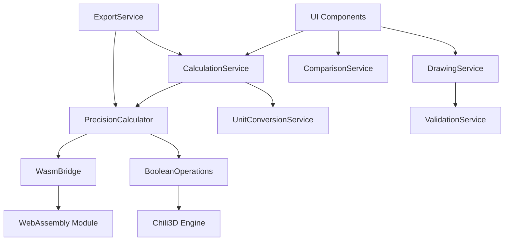

# API Documentation
**Land Visualizer Service Interfaces & Data Contracts**  
*Version 1.0 | August 2025*

---

## 📚 Table of Contents

- [Core Services](#core-services)
  - [CalculationService](#calculationservice)
  - [DrawingService](#drawingservice)
  - [ComparisonService](#comparisonservice)
- [Precision Services (Chili3D)](#precision-services-chili3d)
  - [PrecisionCalculator](#precisioncalculator)
  - [BooleanOperations](#booleanoperations)
  - [WasmBridge](#wasmbridge)
- [Export Services](#export-services)
- [Utility Services](#utility-services)
- [Data Types](#data-types)
- [Error Handling](#error-handling)
- [WebAssembly API](#webassembly-api)

---

## 🔧 Core Services

### CalculationService

Primary service for area and perimeter calculations. Provides both standard JavaScript and Chili3D precision modes.

```typescript
class CalculationService {
  /**
   * Calculate the area of a polygon
   * @param points - Array of points forming the polygon
   * @param options - Calculation options
   * @returns Area in square units
   */
  calculateArea(
    points: Point[], 
    options?: CalculationOptions
  ): CalculationResult

  /**
   * Calculate the perimeter of a polygon
   * @param points - Array of points forming the polygon
   * @returns Perimeter in linear units
   */
  calculatePerimeter(points: Point[]): number

  /**
   * Calculate bounding box dimensions
   * @param points - Array of points
   * @returns Width and height of bounding box
   */
  getBoundingBox(points: Point[]): BoundingBox

  /**
   * Validate if points form a valid polygon
   * @param points - Array of points to validate
   * @returns Validation result with error details
   */
  validatePolygon(points: Point[]): ValidationResult
}

// Options
interface CalculationOptions {
  precision?: 'standard' | 'professional';
  unit?: UnitType;
  includeHoles?: boolean;
}

// Result
interface CalculationResult {
  value: number;
  unit: UnitType;
  precision: 'standard' | 'professional';
  confidence: number; // 0-1
  metadata?: {
    calculationTime: number;
    method: string;
  };
}
```

#### Example Usage

```javascript
const calculator = new CalculationService();

// Basic calculation
const area = calculator.calculateArea([
  { x: 0, y: 0 },
  { x: 100, y: 0 },
  { x: 100, y: 100 },
  { x: 0, y: 100 }
]);
// Returns: { value: 10000, unit: 'm2', precision: 'standard' }

// Professional precision
const preciseArea = calculator.calculateArea(points, {
  precision: 'professional',
  unit: 'acres'
});
// Returns: { value: 2.471, unit: 'acres', precision: 'professional' }
```

---

### DrawingService

Manages shape drawing, editing, and point manipulation.

```typescript
class DrawingService {
  /**
   * Initialize a new drawing session
   * @param canvas - HTML canvas element
   * @param options - Drawing configuration
   */
  initDrawing(
    canvas: HTMLCanvasElement, 
    options?: DrawingOptions
  ): DrawingSession

  /**
   * Add a point to the current shape
   * @param point - Point to add
   * @param session - Current drawing session
   */
  addPoint(point: Point, session: DrawingSession): void

  /**
   * Remove the last added point
   * @param session - Current drawing session
   */
  undoLastPoint(session: DrawingSession): void

  /**
   * Complete the current shape
   * @param session - Current drawing session
   * @returns Completed shape object
   */
  completeShape(session: DrawingSession): Shape

  /**
   * Edit existing shape vertices
   * @param shape - Shape to edit
   * @param vertexIndex - Index of vertex to move
   * @param newPosition - New position for vertex
   */
  editVertex(
    shape: Shape, 
    vertexIndex: number, 
    newPosition: Point
  ): Shape

  /**
   * Apply snapping to a point
   * @param point - Point to snap
   * @param options - Snapping options
   * @returns Snapped point
   */
  snapPoint(point: Point, options?: SnapOptions): Point
}

// Configuration
interface DrawingOptions {
  minPoints?: number;          // Default: 3
  maxPoints?: number;          // Default: unlimited
  autoClose?: boolean;         // Default: true
  snapToGrid?: boolean;        // Default: false
  gridSize?: number;           // Default: 10
  enableGestures?: boolean;    // Default: true
}

interface DrawingSession {
  id: string;
  points: Point[];
  isActive: boolean;
  startTime: Date;
  canvas: HTMLCanvasElement;
  options: DrawingOptions;
}
```

#### Example Usage

```javascript
const drawingService = new DrawingService();

// Start drawing
const session = drawingService.initDrawing(canvas, {
  snapToGrid: true,
  gridSize: 5
});

// Add points
drawingService.addPoint({ x: 100, y: 100 }, session);
drawingService.addPoint({ x: 200, y: 100 }, session);
drawingService.addPoint({ x: 150, y: 200 }, session);

// Complete shape
const shape = drawingService.completeShape(session);
// Returns complete Shape object with calculated properties
```

---

### ComparisonService

Manages reference object library and size comparisons.

```typescript
class ComparisonService {
  /**
   * Get all available comparison objects
   * @param category - Filter by category
   * @returns Array of comparison objects
   */
  getComparisonObjects(category?: Category): ComparisonObject[]

  /**
   * Calculate how many reference objects fit in an area
   * @param area - Area to compare (in m²)
   * @param objectId - ID of comparison object
   * @returns Number of objects that fit
   */
  calculateFit(area: number, objectId: string): FitResult

  /**
   * Get best comparison for an area
   * @param area - Area to compare
   * @returns Most appropriate comparison object
   */
  getBestComparison(area: number): ComparisonRecommendation

  /**
   * Add custom comparison object
   * @param object - Custom comparison object
   */
  addCustomObject(object: CustomComparisonObject): void

  /**
   * Get comparison visualization data
   * @param area - Area to visualize
   * @param objectId - Comparison object ID
   * @returns Visualization configuration
   */
  getVisualizationData(
    area: number, 
    objectId: string
  ): VisualizationData
}

// Types
interface ComparisonObject {
  id: string;
  name: string;
  area: number;          // in m²
  dimensions: {
    width: number;
    height: number;
  };
  category: 'sports' | 'building' | 'vehicle' | 'nature';
  icon: string;          // Icon identifier or URL
  description?: string;
  popularIn?: string[];  // Countries where this comparison is relevant
}

interface FitResult {
  count: number;
  coverage: number;      // Percentage of area covered
  arrangement: 'grid' | 'packed' | 'single';
  visualization: {
    rows: number;
    columns: number;
    partial: boolean;
  };
}
```

#### Built-in Comparison Objects

```javascript
const COMPARISON_OBJECTS = [
  {
    id: 'soccer-field',
    name: 'Soccer Field',
    area: 7140,
    dimensions: { width: 105, height: 68 },
    category: 'sports',
    popularIn: ['EU', 'SA', 'AF']
  },
  {
    id: 'parking-space',
    name: 'Parking Space',
    area: 12.5,
    dimensions: { width: 5, height: 2.5 },
    category: 'building'
  },
  {
    id: 'tennis-court',
    name: 'Tennis Court',
    area: 261,
    dimensions: { width: 23.77, height: 10.97 },
    category: 'sports'
  },
  // ... more objects
];
```

---

## 🎯 Precision Services (Chili3D)

### PrecisionCalculator

High-accuracy calculations using Chili3D geometry engine and WebAssembly.

```typescript
class PrecisionCalculator {
  /**
   * Initialize WASM module and Chili3D engine
   * @returns Promise resolving when ready
   */
  async initialize(): Promise<void>

  /**
   * Calculate area with survey-grade precision
   * @param points - Polygon vertices
   * @returns High-precision area result
   */
  async calculatePreciseArea(points: Point[]): Promise<PrecisionResult>

  /**
   * Validate shape with professional standards
   * @param points - Points to validate
   * @returns Detailed validation report
   */
  async validateProfessional(points: Point[]): Promise<ValidationReport>

  /**
   * Convert between coordinate systems
   * @param points - Points in source system
   * @param from - Source coordinate system
   * @param to - Target coordinate system
   */
  async transformCoordinates(
    points: Point[],
    from: CoordinateSystem,
    to: CoordinateSystem
  ): Promise<Point[]>

  /**
   * Check if precision mode is available
   * @returns Availability status
   */
  isPrecisionAvailable(): boolean
}

interface PrecisionResult {
  area: number;
  perimeter: number;
  centroid: Point;
  accuracy: number;        // ±percentage
  calculationMethod: 'wasm' | 'chili3d' | 'fallback';
  processingTime: number;  // milliseconds
}

interface ValidationReport {
  isValid: boolean;
  issues: ValidationIssue[];
  suggestions: string[];
  topology: {
    isClosed: boolean;
    isSelfIntersecting: boolean;
    isClockwise: boolean;
    holes: number;
  };
}
```

#### Example Usage

```javascript
const precision = new PrecisionCalculator();
await precision.initialize();

// High-precision calculation
const result = await precision.calculatePreciseArea(surveyPoints);
console.log(`Area: ${result.area}m² ±${result.accuracy}%`);

// Professional validation
const validation = await precision.validateProfessional(points);
if (!validation.isValid) {
  console.log('Issues found:', validation.issues);
}
```

---

### BooleanOperations

Property subdivision and boolean geometry operations via Chili3D.

```typescript
class BooleanOperations {
  /**
   * Subdivide a property along a line
   * @param property - Main property shape
   * @param divisionLine - Line or polyline to divide along
   * @returns Array of resulting parcels
   */
  async subdivide(
    property: Shape,
    divisionLine: Line | Polyline
  ): Promise<Shape[]>

  /**
   * Calculate setback area from property boundaries
   * @param property - Property shape
   * @param distance - Setback distance in meters
   * @returns Buildable area after setback
   */
  async calculateSetback(
    property: Shape,
    distance: number
  ): Promise<Shape>

  /**
   * Merge adjacent properties
   * @param properties - Array of adjacent properties
   * @returns Merged property shape
   */
  async mergeProperties(properties: Shape[]): Promise<Shape>

  /**
   * Find intersection of two shapes
   * @param shape1 - First shape
   * @param shape2 - Second shape
   * @returns Intersection area
   */
  async intersection(shape1: Shape, shape2: Shape): Promise<Shape>

  /**
   * Calculate difference between shapes
   * @param shape1 - Main shape
   * @param shape2 - Shape to subtract
   * @returns Resulting shape
   */
  async difference(shape1: Shape, shape2: Shape): Promise<Shape>
}
```

---

### WasmBridge

Low-level WebAssembly interface for performance-critical operations.

```typescript
class WasmBridge {
  /**
   * Load and initialize WASM module
   * @param wasmPath - Path to WASM file
   */
  async loadModule(wasmPath: string): Promise<void>

  /**
   * Execute WASM calculation
   * @param operation - Operation name
   * @param data - Input data
   * @returns Calculation result
   */
  async execute(
    operation: WasmOperation,
    data: Float32Array
  ): Promise<Float32Array>

  /**
   * Get available WASM operations
   * @returns List of operation names
   */
  getAvailableOperations(): WasmOperation[]

  /**
   * Check WASM support
   * @returns Browser support status
   */
  static isSupported(): boolean

  /**
   * Get memory usage
   * @returns Current memory consumption
   */
  getMemoryUsage(): MemoryStats
}

type WasmOperation = 
  | 'calculateArea'
  | 'calculatePerimeter'
  | 'validatePolygon'
  | 'triangulate'
  | 'simplify';

interface MemoryStats {
  used: number;      // bytes
  allocated: number; // bytes
  maximum: number;   // bytes
}
```

---

## 📤 Export Services

### ExportService

Handles various export formats for sharing and professional use.

```typescript
class ExportService {
  /**
   * Export as image
   * @param canvas - Canvas to export
   * provisional
   * @param options - Export options
   * @returns Image blob
   */
  async exportImage(
    canvas: HTMLCanvasElement,
    options?: ImageExportOptions
  ): Promise<Blob>

  /**
   * Export as PDF document
   * @param shape - Shape to export
   * @param calculations - Calculation results
   * @param options - PDF options
   * @returns PDF blob
   */
  async exportPDF(
    shape: Shape,
    calculations: CalculationResult,
    options?: PDFExportOptions
  ): Promise<Blob>

  /**
   * Export as CAD file (via Chili3D)
   * @param shape - Shape to export
   * @param format - CAD format
   * @returns CAD file blob
   */
  async exportCAD(
    shape: Shape,
    format: CADFormat
  ): Promise<Blob>

  /**
   * Generate shareable link
   * @param shape - Shape to share
   * @returns Shareable URL
   */
  async createShareLink(shape: Shape): Promise<string>

  /**
   * Export measurement report
   * @param data - Complete measurement data
   * @returns Report document
   */
  async exportReport(data: MeasurementData): Promise<Blob>
}

// Options
interface ImageExportOptions {
  format: 'png' | 'jpeg' | 'webp';
  quality?: number;        // 0-1 for jpeg/webp
  width?: number;
  height?: number;
  includeGrid?: boolean;
  includeLabels?: boolean;
}

interface PDFExportOptions {
  paperSize: 'a4' | 'letter' | 'legal';
  orientation: 'portrait' | 'landscape';
  includeMetadata?: boolean;
  includeMeasurements?: boolean;
  includeComparisons?: boolean;
  title?: string;
  author?: string;
}

type CADFormat = 'dxf' | 'step' | 'iges' | 'stl';
```

---

## 🛠️ Utility Services

### UnitConversionService

Handles all unit conversions for area and length measurements.

```typescript
class UnitConversionService {
  /**
   * Convert area between units
   * @param value - Value to convert
   * @param from - Source unit
   * @param to - Target unit
   * @returns Converted value
   */
  convertArea(
    value: number,
    from: AreaUnit,
    to: AreaUnit
  ): number

  /**
   * Convert length between units
   * @param value - Value to convert
   * @param from - Source unit
   * @param to - Target unit
   * @returns Converted value
   */
  convertLength(
    value: number,
    from: LengthUnit,
    to: LengthUnit
  ): number

  /**
   * Format value with appropriate unit
   * @param value - Numeric value
   * @param unit - Unit type
   * @param locale - Locale for formatting
   * @returns Formatted string
   */
  format(
    value: number,
    unit: Unit,
    locale?: string
  ): string

  /**
   * Get conversion factor between units
   * @param from - Source unit
   * @param to - Target unit
   * @returns Multiplication factor
   */
  getConversionFactor(from: Unit, to: Unit): number
}

// Unit types
type AreaUnit = 'm2' | 'ft2' | 'acres' | 'hectares' | 'km2' | 'miles2';
type LengthUnit = 'm' | 'ft' | 'km' | 'miles' | 'yards';
type Unit = AreaUnit | LengthUnit;
```

#### Conversion Table

| From | To | Factor |
|------|-----|--------|
| m² | ft² | 10.764 |
| m² | acres | 0.000247 |
| m² | hectares | 0.0001 |
| acres | m² | 4047 |
| hectares | m² | 10000 |

---

### ValidationService

Input validation and shape verification.

```typescript
class ValidationService {
  /**
   * Validate point coordinates
   * @param point - Point to validate
   * @returns Validation result
   */
  validatePoint(point: Point): ValidationResult

  /**
   * Validate polygon shape
   * @param points - Polygon vertices
   * @returns Detailed validation
   */
  validatePolygon(points: Point[]): PolygonValidation

  /**
   * Check if shape is simple (non-self-intersecting)
   * @param points - Shape vertices
   * @returns True if simple
   */
  isSimplePolygon(points: Point[]): boolean

  /**
   * Sanitize user input
   * @param input - Raw user input
   * @param type - Expected data type
   * @returns Sanitized value
   */
  sanitizeInput<T>(input: unknown, type: DataType): T

  /**
   * Validate export options
   * @param options - Export options to validate
   * @returns Validation result
   */
  validateExportOptions(options: any): ValidationResult
}

interface PolygonValidation {
  valid: boolean;
  errors: string[];
  warnings: string[];
  properties: {
    vertexCount: number;
    isClosed: boolean;
    isSimple: boolean;
    isConvex: boolean;
    area: number;
    perimeter: number;
  };
}
```

---

## 📊 Data Types

### Core Types

```typescript
// Geometric types
interface Point {
  x: number;
  y: number;
  z?: number;
}

interface Line {
  start: Point;
  end: Point;
}

interface Polyline {
  points: Point[];
}

interface Shape {
  id: string;
  points: Point[];
  closed: boolean;
  area?: number;
  perimeter?: number;
  centroid?: Point;
  boundingBox?: BoundingBox;
  metadata?: ShapeMetadata;
}

interface BoundingBox {
  min: Point;
  max: Point;
  width: number;
  height: number;
  center: Point;
}

interface ShapeMetadata {
  name?: string;
  createdAt: Date;
  modifiedAt: Date;
  author?: string;
  notes?: string;
}

// Calculation types
interface CalculationResult {
  value: number;
  unit: string;
  precision: 'standard' | 'professional';
  confidence: number;
  timestamp: Date;
}

// Coordinate systems
enum CoordinateSystem {
  SCREEN = 'screen',
  CARTESIAN = 'cartesian',
  GEOGRAPHIC = 'geographic',
  UTM = 'utm'
}

// Error types
interface APIError {
  code: string;
  message: string;
  details?: any;
  timestamp: Date;
  stack?: string;
}
```

---

## ⚠️ Error Handling

### Error Codes

```typescript
enum ErrorCode {
  // Validation errors (1xxx)
  INVALID_POINT = 'ERR_1001',
  INVALID_POLYGON = 'ERR_1002',
  INSUFFICIENT_POINTS = 'ERR_1003',
  SELF_INTERSECTING = 'ERR_1004',
  
  // Calculation errors (2xxx)
  CALCULATION_FAILED = 'ERR_2001',
  PRECISION_UNAVAILABLE = 'ERR_2002',
  WASM_LOAD_FAILED = 'ERR_2003',
  
  // Export errors (3xxx)
  EXPORT_FAILED = 'ERR_3001',
  UNSUPPORTED_FORMAT = 'ERR_3002',
  
  // System errors (9xxx)
  UNKNOWN_ERROR = 'ERR_9001',
  OUT_OF_MEMORY = 'ERR_9002'
}
```

### Error Handling Pattern

```typescript
try {
  const result = await calculator.calculatePreciseArea(points);
  return result;
} catch (error) {
  if (error.code === ErrorCode.WASM_LOAD_FAILED) {
    // Fallback to standard calculation
    console.warn('WASM unavailable, using standard calculation');
    return calculator.calculateArea(points);
  } else if (error.code === ErrorCode.INVALID_POLYGON) {
    // Show user-friendly message
    throw new UserError('Please draw a valid shape');
  } else {
    // Log and report unknown errors
    console.error('Unexpected error:', error);
    throw error;
  }
}
```

---

## 🔄 WebAssembly API

### Direct WASM Interface

For performance-critical applications, direct WASM calls are available:

```javascript
// Load WASM module
const wasmModule = await WebAssembly.instantiateStreaming(
  fetch('/wasm/land-geometry.wasm')
);

// Get exported functions
const { 
  calculatePolygonArea,
  validatePolygon,
  simplifyPolygon
} = wasmModule.instance.exports;

// Prepare data (flatten point array)
const points = new Float32Array([
  0, 0,      // x1, y1
  100, 0,    // x2, y2
  100, 100,  // x3, y3
  0, 100     // x4, y4
]);

// Allocate memory
const ptr = wasmModule.instance.exports.malloc(points.byteLength);
const memory = new Float32Array(
  wasmModule.instance.exports.memory.buffer,
  ptr,
  points.length
);
memory.set(points);

// Call WASM function
const area = calculatePolygonArea(ptr, points.length / 2);

// Free memory
wasmModule.instance.exports.free(ptr);

console.log(`Area: ${area}`);
```

### WASM Function Signatures

```c
// Available WASM exports
float calculatePolygonArea(float* points, int count);
int validatePolygon(float* points, int count);
void simplifyPolygon(float* input, int inCount, float* output, float tolerance);
void triangulate(float* points, int count, int* indices);
float calculatePerimeter(float* points, int count);
void calculateCentroid(float* points, int count, float* result);
```

---

## 🔗 Service Dependencies



---

## 📝 API Usage Examples

### Complete Drawing Flow

```javascript
// 1. Initialize services
const drawer = new DrawingService();
const calculator = new CalculationService();
const exporter = new ExportService();

// 2. Start drawing
const session = drawer.initDrawing(canvas, {
  snapToGrid: true,
  autoClose: true
});

// 3. Add points (from user clicks)
drawer.addPoint({ x: 100, y: 100 }, session);
drawer.addPoint({ x: 300, y: 100 }, session);
drawer.addPoint({ x: 200, y: 250 }, session);

// 4. Complete shape
const shape = drawer.completeShape(session);

// 5. Calculate properties
const area = await calculator.calculateArea(shape.points, {
  precision: 'professional'
});

// 6. Export results
const pdf = await exporter.exportPDF(shape, area, {
  paperSize: 'a4',
  includeMeasurements: true
});
```

### Subdivision Workflow

```javascript
// 1. Load property
const property = await loadPropertyShape();

// 2. Define subdivision line
const divisionLine = {
  start: { x: 150, y: 0 },
  end: { x: 150, y: 300 }
};

// 3. Perform subdivision
const operations = new BooleanOperations();
const parcels = await operations.subdivide(property, divisionLine);

// 4. Calculate areas for each parcel
const parcelData = await Promise.all(
  parcels.map(async parcel => ({
    shape: parcel,
    area: await calculator.calculateArea(parcel.points),
    setback: await operations.calculateSetback(parcel, 5)
  }))
);

// 5. Export subdivision plan
const report = await exporter.exportReport({
  original: property,
  parcels: parcelData,
  timestamp: new Date()
});
```

---

## 🔐 API Rate Limiting

While Land Visualizer is primarily client-side, some operations may have practical limits:

| Operation | Limit | Window | Notes |
|-----------|-------|--------|-------|
| WASM calculations | 1000/min | Per session | Prevent memory exhaustion |
| Export operations | 10/min | Per session | Prevent abuse |
| Share link generation | 5/min | Per session | If backend implemented |

---

## 📚 Further Documentation

- [Architecture Overview](ARCHITECTURE.md) - System design and patterns
- [Testing Strategy](TESTING.md) - Test examples and coverage
- [Chili3D Integration](docs/chili3d_integration_plan.md) - Detailed integration guide
- [WebAssembly Guide](docs/wasm-guide.md) - WASM optimization tips

---

*This API documentation provides the complete interface specification for Land Visualizer services. All services are designed for client-side execution with optional WebAssembly acceleration.*